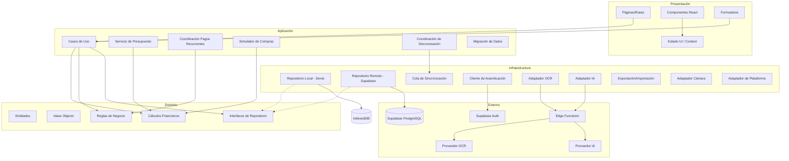
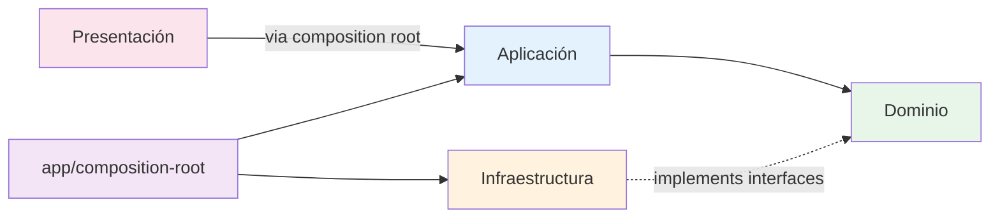
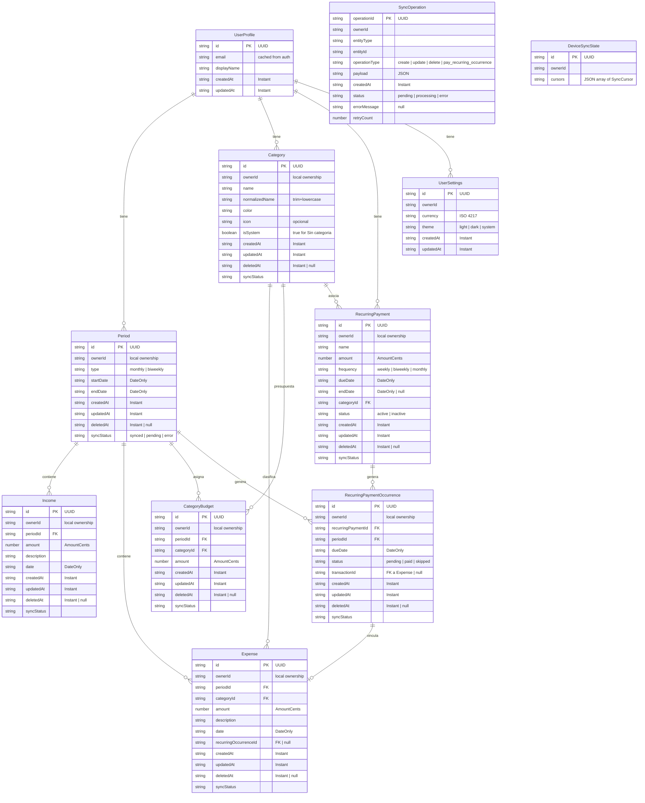
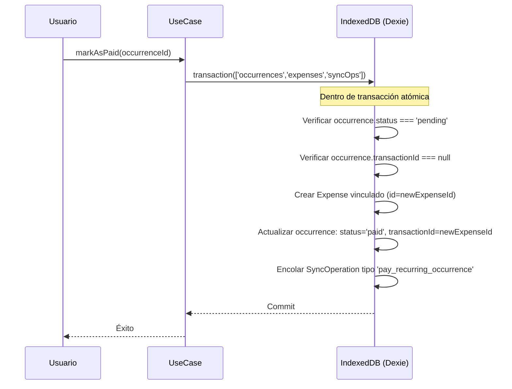
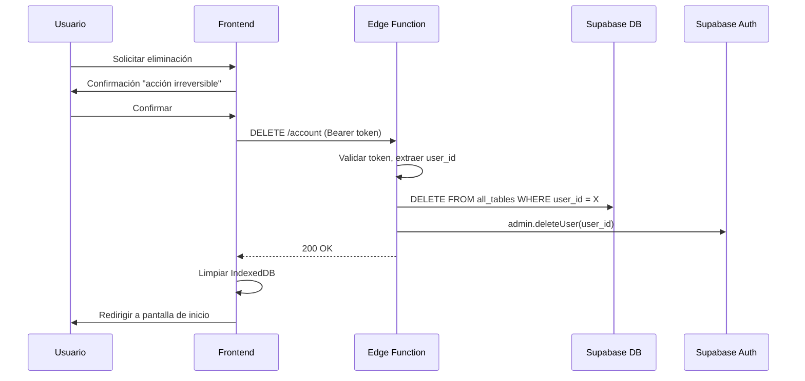
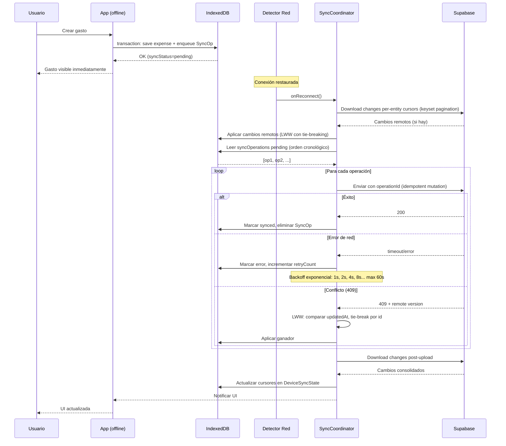
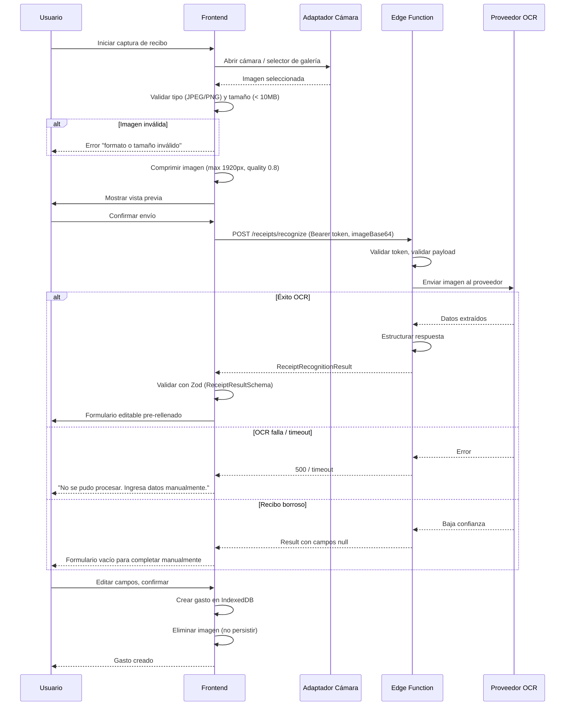

# Design Document — Lunumia

## Overview

Lunumia es una aplicación local-first de presupuestos personales construida con React, TypeScript (strict), Vite, Dexie/IndexedDB, Supabase Auth, Supabase PostgreSQL, Supabase Edge Functions, Zod, vite-plugin-pwa y Capacitor para Android. Permite al usuario organizar ingresos, distribuir dinero entre categorías, registrar gastos, controlar pagos recurrentes y calcular cuánto dinero puede gastar realmente sin afectar sus compromisos.

La aplicación opera en seis fases secuenciales:

1. **Fase 1 — PWA local**: Persistencia offline completa con IndexedDB.
2. **Fase 2 — Autenticación y nube**: Registro, login, sesión y Supabase PostgreSQL.
3. **Fase 3 — Sincronización**: Bidireccional con last-write-wins.
4. **Fase 4 — Reconocimiento de recibos**: OCR mediante Edge Functions.
5. **Fase 5 — Inteligencia artificial**: Sugerencias y resúmenes.
6. **Fase 6 — Android**: Empaquetado con Capacitor.

### Principios de diseño

- **Local-first**: IndexedDB es la fuente primaria; la nube es réplica.
- **Offline-capable**: Todas las funciones financieras operan sin conexión.
- **Determinismo financiero**: Los cálculos con enteros en centavos producen resultados idénticos al recomputar.
- **Seguridad por diseño**: RLS, tokens, secretos solo en servidor.
- **Adaptadores desacoplados**: OCR e IA como interfaces sustituibles.

---

## Architecture

### Diagrama general de arquitectura



### Diagrama de dependencias entre capas



**Reglas de dependencia:**

- **Dominio** → Sin dependencias externas. No importa React, Dexie, Supabase ni Zod.
- **Aplicación** → Depende solo de Dominio (interfaces). Usa contratos de validación de `application/contracts/`.
- **Infraestructura** → Implementa interfaces de Dominio. Depende de librerías externas (Dexie, Supabase SDK).
- **Presentación** → Depende de Aplicación (via composition root). **NO** importa directamente de repositorios Dexie, clientes Supabase ni adaptadores concretos.
- **app/composition-root** → Instancia infraestructura e inyecta casos de uso en la presentación. Es el único lugar donde se conectan las capas concretas.

### Capas detalladas

#### 1. Capa de Dominio

Responsabilidades:

- Entidades con reglas de negocio internas (Period, Income, Expense, Category, etc.).
- Value Objects inmutables (AmountCents, SignedMoneyCents, DateOnly, Instant, PeriodType, SyncStatus).
- Funciones puras de cálculos financieros (saldo, presupuesto restante, disponible real, ritmo).
- Reglas de negocio (validación de solapamiento de periodos, unicidad de categorías, atomicidad de pago recurrente).
- Interfaces de repositorio (contratos sin implementación).

Restricción: **Cero dependencias** de React, Dexie, Supabase, Zod o cualquier librería de infraestructura.

#### 2. Capa de Aplicación

Responsabilidades:

- Casos de uso que orquestan operaciones (CreateExpense, MarkOccurrenceAsPaid, SimulatePurchase).
- Servicio de presupuesto (cálculo agregado de presupuestos por periodo).
- Coordinación de pagos recurrentes (generación de ocurrencias, validación de duplicados).
- Simulador de compras (proyección de impacto).
- Coordinación de sincronización (orquestación upload/download).
- Migración de datos locales a cuenta autenticada.
- Subcarpeta `contracts/` con esquemas Zod de validación de entrada/salida.

#### 3. Capa de Infraestructura

Responsabilidades:

- `DexieRepository`: implementación del repositorio local con Dexie.
- `SupabaseRepository`: implementación del repositorio remoto.
- `SyncQueue`: cola de operaciones pendientes con persistencia en IndexedDB.
- `AuthClient`: wrapper de Supabase Auth.
- `OCRAdapter` / `AIAdapter`: adaptadores que llaman a Edge Functions.
- `BackupService`: exportación/importación de archivos JSON.
- `CameraAdapter`: abstracción que usa API web o Capacitor Camera plugin.
- `PlatformAdapter`: detecta web vs Android y provee funcionalidad específica.

#### 4. Capa de Presentación

Responsabilidades:

- Páginas (Dashboard, Periodos, Ingresos, Gastos, Categorías, Presupuestos, Recurrentes, Simulador, Configuración, Auth).
- Componentes reutilizables (MoneyDisplay, DatePicker, StatusBadge, LoadingState, EmptyState).
- Formularios con validación integrada (los esquemas Zod viven en `application/contracts/`).
- Estado de interfaz mediante React Context y hooks.
- Navegación con React Router.
- Diseño responsive (320px–1440px) y accesible (WCAG AA).
- **NO importa directamente** de `infrastructure/`. Recibe dependencias inyectadas desde `composition-root`.

#### 5. Composition Root

Archivo: `src/app/composition-root.ts`

Responsabilidades:

- Instanciar repositorios concretos (DexieRepository, SupabaseRepository).
- Instanciar adaptadores concretos (AuthClient, OCRAdapter, AIAdapter, PlatformAdapter).
- Crear instancias de casos de uso inyectando repositorios/adaptadores.
- Exportar un objeto de contexto que la presentación consume.
- Es el **único módulo** que importa de infraestructura Y aplicación simultáneamente.

---

## Components and Interfaces

### Interfaces de Repositorio (Dominio)

```typescript
// domain/repositories/IExpenseRepository.ts
interface IExpenseRepository {
  create(expense: Expense): Promise<Expense>
  update(expense: Expense): Promise<Expense>
  delete(id: string): Promise<void>
  findById(id: string): Promise<Expense | null>
  findByPeriod(periodId: string): Promise<Expense[]>
  findByCategory(categoryId: string): Promise<Expense[]>
}

// domain/repositories/IIncomeRepository.ts
interface IIncomeRepository {
  create(income: Income): Promise<Income>
  update(income: Income): Promise<Income>
  delete(id: string): Promise<void>
  findById(id: string): Promise<Income | null>
  findByPeriod(periodId: string): Promise<Income[]>
}

// domain/repositories/IPeriodRepository.ts
interface IPeriodRepository {
  create(period: Period): Promise<Period>
  update(period: Period): Promise<Period>
  findById(id: string): Promise<Period | null>
  findAll(): Promise<Period[]>
  findOverlapping(
    startDate: string,
    endDate: string,
    excludeId?: string,
  ): Promise<Period[]>
  findByDateRange(date: string): Promise<Period | null>
}

// domain/repositories/ICategoryRepository.ts
interface ICategoryRepository {
  create(category: Category): Promise<Category>
  update(category: Category): Promise<Category>
  delete(id: string): Promise<void>
  findById(id: string): Promise<Category | null>
  findAll(): Promise<Category[]>
  findByNormalizedName(normalizedName: string): Promise<Category | null>
  countExpensesByCategory(categoryId: string): Promise<number>
  findSystemCategory(): Promise<Category>
}

// domain/repositories/ICategoryBudgetRepository.ts
interface ICategoryBudgetRepository {
  upsert(budget: CategoryBudget): Promise<CategoryBudget>
  findByPeriod(periodId: string): Promise<CategoryBudget[]>
  findByPeriodAndCategory(
    periodId: string,
    categoryId: string,
  ): Promise<CategoryBudget | null>
}

// domain/repositories/IRecurringPaymentRepository.ts
interface IRecurringPaymentRepository {
  create(payment: RecurringPayment): Promise<RecurringPayment>
  update(payment: RecurringPayment): Promise<RecurringPayment>
  delete(id: string): Promise<void>
  findById(id: string): Promise<RecurringPayment | null>
  findActive(): Promise<RecurringPayment[]>
}

// domain/repositories/IRecurringPaymentOccurrenceRepository.ts
interface IRecurringPaymentOccurrenceRepository {
  create(
    occurrence: RecurringPaymentOccurrence,
  ): Promise<RecurringPaymentOccurrence>
  update(
    occurrence: RecurringPaymentOccurrence,
  ): Promise<RecurringPaymentOccurrence>
  findByPeriod(periodId: string): Promise<RecurringPaymentOccurrence[]>
  findByPaymentAndPeriod(
    paymentId: string,
    periodId: string,
  ): Promise<RecurringPaymentOccurrence[]>
  findPendingByPeriod(periodId: string): Promise<RecurringPaymentOccurrence[]>
}

// domain/repositories/ISyncOperationRepository.ts
interface ISyncOperationRepository {
  enqueue(operation: SyncOperation): Promise<void>
  dequeue(operationId: string): Promise<void>
  findPending(): Promise<SyncOperation[]>
  findByStatus(status: SyncOperationStatus): Promise<SyncOperation[]>
  markError(operationId: string, error: string): Promise<void>
  count(): Promise<number>
}
```

### Interfaces de Servicios Externos

```typescript
// domain/ports/ReceiptRecognitionProvider.ts
interface ReceiptRecognitionResult {
  merchant: string | null
  date: string | null // DateOnly
  total: number | null // centavos
  currency: string | null
}

interface ReceiptRecognitionProvider {
  recognize(
    imageBase64: string,
    authToken: string,
  ): Promise<ReceiptRecognitionResult>
}

// domain/ports/AIInsightsProvider.ts
interface CategorySuggestion {
  categoryId: string
  confidence: number
}

interface PeriodSummary {
  text: string
  highlights: string[]
}

interface CategoryChangeExplanation {
  categoryId: string
  explanation: string
}

interface AIInsightsProvider {
  suggestCategory(
    description: string,
    categories: { id: string; name: string }[],
    authToken: string,
  ): Promise<CategorySuggestion | null>

  generatePeriodSummary(
    aggregatedData: PeriodAggregatedData,
    authToken: string,
  ): Promise<PeriodSummary>

  explainCategoryChanges(
    changes: CalculatedCategoryChange[],
    authToken: string,
  ): Promise<CategoryChangeExplanation[]>
}
```

### Casos de Uso (Aplicación)

```typescript
// application/use-cases/CreateExpenseUseCase.ts
interface CreateExpenseInput {
  amount: AmountCents // entero > 0
  description: string
  date: string // DateOnly
  categoryId: string
  periodId: string
}

// application/use-cases/MarkOccurrenceAsPaidUseCase.ts
// Orquesta: actualizar occurrence.status → crear gasto vinculado → todo en transacción atómica

// application/use-cases/SimulatePurchaseUseCase.ts
interface SimulationResult {
  currentAvailable: SignedMoneyCents
  afterPurchaseAvailable: SignedMoneyCents
  categoryBudgetRemaining: SignedMoneyCents
  isNegative: boolean
}

// application/services/SyncCoordinator.ts
interface SyncCoordinator {
  uploadPendingChanges(): Promise<SyncResult>
  downloadRemoteChanges(cursors: SyncCursor[]): Promise<DownloadResult>
  fullSync(): Promise<void>
}
```

---

## Data Models

### Diagrama de modelo de datos



### Interfaces TypeScript de Entidades

```typescript
// === Value Objects ===

type DateOnly = string // formato YYYY-MM-DD
type Instant = string // formato UTC YYYY-MM-DDTHH:mm:ss.sssZ

/** Entero >= 0 para montos almacenados (ingresos, gastos, presupuestos, montos de pagos recurrentes) */
type AmountCents = number

/** Entero que PUEDE ser negativo para saldos, diferencias, presupuesto restante y dinero disponible real */
type SignedMoneyCents = number

type PeriodType = 'monthly' | 'biweekly'
type Frequency = 'weekly' | 'biweekly' | 'monthly'
type OccurrenceStatus = 'pending' | 'paid' | 'skipped'
type PaymentStatus = 'active' | 'inactive'
type SyncStatus = 'synced' | 'pending' | 'error'
type SyncOperationType =
  'create' | 'update' | 'delete' | 'pay_recurring_occurrence'
type SyncOperationStatus = 'pending' | 'processing' | 'error'

// === Base sincronizable ===

interface SyncableEntity {
  id: string // UUID v4
  ownerId: string // Siempre presente. Formato 'guest:{uuid}' antes de registro, UUID de Supabase tras autenticación
  createdAt: Instant
  updatedAt: Instant
  deletedAt: Instant | null // tombstone para soft-delete
  syncStatus: SyncStatus
}

// === Entidades ===

interface UserProfile {
  id: string
  email: string // Copia cacheada de auth.users para display. La fuente autoritativa es Supabase Auth.
  displayName: string
  createdAt: Instant
  updatedAt: Instant
}

interface Period extends SyncableEntity {
  type: PeriodType
  startDate: DateOnly
  endDate: DateOnly
}

interface Income extends SyncableEntity {
  periodId: string
  amount: AmountCents // centavos, > 0
  description: string
  date: DateOnly
}

interface Expense extends SyncableEntity {
  periodId: string
  categoryId: string
  amount: AmountCents // centavos, > 0
  description: string
  date: DateOnly
  recurringOccurrenceId: string | null
}

interface Category extends SyncableEntity {
  name: string
  normalizedName: string // name.trim().toLowerCase()
  color: string // hex e.g. "#FF5722"
  icon: string | null
  isSystem: boolean // true para "Sin categoría", no puede eliminarse ni renombrarse
}

interface CategoryBudget extends SyncableEntity {
  periodId: string
  categoryId: string
  amount: AmountCents // centavos, >= 0
}

interface RecurringPayment extends SyncableEntity {
  name: string
  amount: AmountCents // centavos, > 0
  frequency: Frequency
  dueDate: DateOnly // día base para calcular ocurrencias
  endDate: DateOnly | null // fecha final opcional, inclusiva
  categoryId: string
  status: PaymentStatus
}

interface RecurringPaymentOccurrence extends SyncableEntity {
  recurringPaymentId: string
  periodId: string
  dueDate: DateOnly
  status: OccurrenceStatus
  transactionId: string | null // FK a Expense.id cuando status=paid
}

interface SyncOperation {
  operationId: string // UUID único para idempotencia
  ownerId: string
  entityType: string // 'period' | 'income' | 'expense' | etc.
  entityId: string
  operationType: SyncOperationType
  payload: string // JSON serializado de la entidad
  createdAt: Instant
  status: SyncOperationStatus
  errorMessage: string | null
  retryCount: number
}

/** Configuración de usuario — se sincroniza con Supabase */
interface UserSettings {
  id: string
  ownerId: string
  currency: string // ISO 4217, e.g. "MXN", "USD"
  theme: 'light' | 'dark' | 'system'
  createdAt: Instant
  updatedAt: Instant
}

/** Estado de sincronización del dispositivo — LOCAL ONLY, nunca se sincroniza */
interface DeviceSyncState {
  id: string
  ownerId: string
  cursors: SyncCursor[] // Un cursor por tipo de entidad
}

/** Cursor de sincronización por tipo de entidad */
interface SyncCursor {
  entityType: string // 'period' | 'income' | 'expense' | etc.
  updatedAt: Instant // Último updatedAt descargado
  entityId: string // Para tie-breaking determinista (keyset pagination)
}
```

### Tablas PostgreSQL (Supabase)

| Tabla                           | PK                        | FKs                                                                                                                                                        | Índices                                                                                          | Unicidad                                                                                           | Eliminación                    |
| ------------------------------- | ------------------------- | ---------------------------------------------------------------------------------------------------------------------------------------------------------- | ------------------------------------------------------------------------------------------------ | -------------------------------------------------------------------------------------------------- | ------------------------------ |
| `user_profiles`                 | `id` (UUID, = auth.uid()) | —                                                                                                                                                          | `email`                                                                                          | `email` UNIQUE                                                                                     | CASCADE al eliminar auth user  |
| `user_settings`                 | `id` (UUID)               | `user_id` → auth.users                                                                                                                                     | —                                                                                                | `user_id` UNIQUE                                                                                   | Hard-delete con la cuenta      |
| `periods`                       | `id` (UUID)               | `user_id` → auth.users                                                                                                                                     | `(user_id, start_date)`, `(user_id, end_date)`, `(user_id, updated_at, id)`                      | Exclusion constraint (ver abajo)                                                                   | Soft-delete (deleted_at)       |
| `incomes`                       | `id` (UUID)               | `(user_id, period_id)` → periods(user_id, id)                                                                                                              | `(user_id, period_id)`, `(user_id, date)`, `(user_id, updated_at, id)`                           | —                                                                                                  | Soft-delete                    |
| `expenses`                      | `id` (UUID)               | `(user_id, period_id)` → periods(user_id, id), `(user_id, category_id)` → categories(user_id, id)                                                          | `(user_id, period_id)`, `(user_id, category_id)`, `(user_id, date)`, `(user_id, updated_at, id)` | `UNIQUE(recurring_occurrence_id) WHERE recurring_occurrence_id IS NOT NULL AND deleted_at IS NULL` | Soft-delete                    |
| `categories`                    | `id` (UUID)               | `user_id` → auth.users                                                                                                                                     | `(user_id, normalized_name)`, `(user_id, updated_at, id)`                                        | `(user_id, normalized_name)` UNIQUE WHERE deleted_at IS NULL                                       | Soft-delete                    |
| `category_budgets`              | `id` (UUID)               | `(user_id, period_id)` → periods(user_id, id), `(user_id, category_id)` → categories(user_id, id)                                                          | `(user_id, period_id)`, `(user_id, updated_at, id)`                                              | `(user_id, period_id, category_id)` UNIQUE WHERE deleted_at IS NULL                                | Soft-delete                    |
| `recurring_payments`            | `id` (UUID)               | `(user_id, category_id)` → categories(user_id, id)                                                                                                         | `(user_id, status)`, `(user_id, updated_at, id)`                                                 | —                                                                                                  | Soft-delete                    |
| `recurring_payment_occurrences` | `id` (UUID)               | `(user_id, recurring_payment_id)` → recurring_payments(user_id, id), `(user_id, period_id)` → periods(user_id, id), `transaction_id` → expenses (nullable) | `(user_id, period_id)`, `(recurring_payment_id, due_date)`, `(user_id, updated_at, id)`          | `(recurring_payment_id, due_date)` UNIQUE WHERE deleted_at IS NULL                                 | Soft-delete                    |
| `processed_operations`          | `operation_id` (UUID)     | `user_id` → auth.users                                                                                                                                     | `(user_id, operation_id)`                                                                        | `operation_id` UNIQUE                                                                              | Hard-delete tras TTL (30 días) |

**Nota sobre `user_profiles.email`:** El campo `email` es una copia cacheada de `auth.users.email` para fines de display. La fuente autoritativa del email es siempre Supabase Auth (`auth.users`). Si el usuario cambia su email en Supabase Auth, la app debe actualizar la copia cacheada en el próximo login/sync.

**Nota sobre `processed_operations`:** Esta tabla es remota (PostgreSQL) y almacena los `operation_id` de operaciones ya procesadas para garantizar idempotencia. NO confundir con la `sync_queue` local en IndexedDB (tabla `SyncOperation` de Dexie).

**Constraint de no-solapamiento de periodos:**

```sql
-- Usa exclusion constraint con GiST en lugar de check constraint
ALTER TABLE periods ADD CONSTRAINT no_overlap_per_user
  EXCLUDE USING GIST (
    user_id WITH =,
    daterange(start_date, end_date, '[]') WITH &&
  )
  WHERE (deleted_at IS NULL);
```

El constraint ignora registros con `deleted_at IS NOT NULL` (tombstones).

**Constraint de unicidad de gasto por ocurrencia recurrente:**

```sql
CREATE UNIQUE INDEX idx_expenses_one_per_occurrence
  ON expenses(recurring_occurrence_id)
  WHERE recurring_occurrence_id IS NOT NULL AND deleted_at IS NULL;
```

**Foreign keys compuestas para integridad cross-user:**

```sql
-- Previene que un gasto referencie un periodo de otro usuario
ALTER TABLE expenses ADD CONSTRAINT fk_expense_period
  FOREIGN KEY (user_id, period_id) REFERENCES periods(user_id, id);

-- Previene que un gasto referencie una categoría de otro usuario
ALTER TABLE expenses ADD CONSTRAINT fk_expense_category
  FOREIGN KEY (user_id, category_id) REFERENCES categories(user_id, id);

-- Previene que un category_budget referencie un periodo de otro usuario
ALTER TABLE category_budgets ADD CONSTRAINT fk_budget_period
  FOREIGN KEY (user_id, period_id) REFERENCES periods(user_id, id);

-- Previene que un category_budget referencie una categoría de otro usuario
ALTER TABLE category_budgets ADD CONSTRAINT fk_budget_category
  FOREIGN KEY (user_id, category_id) REFERENCES categories(user_id, id);

-- Previene que un recurring_payment referencie una categoría de otro usuario
ALTER TABLE recurring_payments ADD CONSTRAINT fk_recurring_category
  FOREIGN KEY (user_id, category_id) REFERENCES categories(user_id, id);

-- Previene que una ocurrencia referencie un recurring_payment de otro usuario
ALTER TABLE recurring_payment_occurrences ADD CONSTRAINT fk_occurrence_payment
  FOREIGN KEY (user_id, recurring_payment_id) REFERENCES recurring_payments(user_id, id);

-- Previene que una ocurrencia referencie un periodo de otro usuario
ALTER TABLE recurring_payment_occurrences ADD CONSTRAINT fk_occurrence_period
  FOREIGN KEY (user_id, period_id) REFERENCES periods(user_id, id);
```

**Nota sobre integridad cross-user:** Las políticas RLS basadas únicamente en el `user_id` de la fila hija NO son suficientes para prevenir que un cliente malicioso establezca un FK apuntando al registro de otro usuario. Las FK compuestas que incluyen `user_id` garantizan integridad referencial entre usuarios a nivel de base de datos.

**Localmente (IndexedDB):** La capa de casos de uso valida que las entidades referenciadas comparten el mismo `ownerId` antes de persistir, ya que IndexedDB no soporta foreign keys.

**Convenciones de columnas comunes** (tablas sincronizables):

- `created_at` TIMESTAMPTZ NOT NULL DEFAULT now()
- `updated_at` TIMESTAMPTZ NOT NULL DEFAULT now()
- `deleted_at` TIMESTAMPTZ NULL (tombstone)
- Todas las columnas usan snake_case: `user_id`, `period_id`, `category_id`, `recurring_payment_id`, `recurring_occurrence_id`, `transaction_id`, `operation_id`, `start_date`, `end_date`, `due_date`, `retry_count`, `error_message`, `entity_type`, `entity_id`, `operation_type`, `sync_status`, `normalized_name`, `is_system`, `owner_id`

**Comportamiento de eliminación**: Todas las entidades sincronizables usan soft-delete (campo `deleted_at`). Los queries excluyen registros con `deleted_at IS NOT NULL` excepto durante sincronización.

### Políticas RLS (Conceptuales)

```sql
-- Ejemplo: tabla expenses
CREATE POLICY "Users can only see their own expenses"
  ON expenses FOR SELECT
  USING (user_id = auth.uid());

CREATE POLICY "Users can only insert their own expenses"
  ON expenses FOR INSERT
  WITH CHECK (user_id = auth.uid());

CREATE POLICY "Users can only update their own expenses"
  ON expenses FOR UPDATE
  USING (user_id = auth.uid())
  WITH CHECK (user_id = auth.uid());

CREATE POLICY "Users can only delete their own expenses"
  ON expenses FOR DELETE
  USING (user_id = auth.uid());
```

Patrón aplicado a **todas** las tablas con `user_id`. Cada política garantiza `user_id = auth.uid()`.

**Importante:** RLS por sí solo NO previene referencias cross-user en FKs. Las FK compuestas (definidas arriba) son necesarias como complemento.

---

## Pagos Recurrentes — Flujo Completo

### Crear regla de pago recurrente

1. El usuario completa formulario: nombre, monto (centavos), frecuencia, fecha base de vencimiento, categoría.
2. Validación Zod (en `application/contracts/`): monto > 0, frecuencia válida, categoría existente y del mismo ownerId.
3. Se crea la entidad `RecurringPayment` con status `active`.
4. Se persiste en IndexedDB y se encola operación de sync.

### Generar ocurrencias para un periodo

Cuando se activa un periodo, el sistema genera `RecurringPaymentOccurrence` para cada pago activo:

**Algoritmo de generación:**

```
Para cada RecurringPayment activo:
  Definir generationEnd como el menor valor entre period.endDate y
  RecurringPayment.endDate cuando exista.
  Según frecuencia:
    - weekly: generar una ocurrencia por cada semana dentro del rango [period.startDate, generationEnd]
      cuyo día de semana coincida con el día de semana de dueDate.
    - biweekly: generar una ocurrencia cada 14 días a partir de dueDate, filtrando las que caen
      dentro de [period.startDate, generationEnd].
    - monthly: generar una ocurrencia por mes cuyo día sea el de dueDate (ajustar al último día
      del mes si el mes no tiene ese día), sin superar generationEnd.

  Para cada fecha calculada:
    SI NO existe ya una ocurrencia con (recurringPaymentId, dueDate):
      Crear RecurringPaymentOccurrence con status=pending, transactionId=null.
```

### Marcar como paid — Operación atómica local



### Marcar como paid — Operación atómica remota (pay_recurring_occurrence)

La sincronización del pago de ocurrencia se ejecuta como una operación compuesta transaccional en PostgreSQL (vía función o Edge Function):

```sql
-- Pseudocódigo de la función PostgreSQL/Edge Function
BEGIN;
  -- 1. Verificar idempotencia
  IF EXISTS (SELECT 1 FROM processed_operations WHERE operation_id = $operationId) THEN
    RETURN success; -- Ya procesado
  END IF;

  -- 2. Verificar precondiciones
  SELECT * FROM recurring_payment_occurrences WHERE id = $occurrenceId AND status = 'pending' AND transaction_id IS NULL;
  IF NOT FOUND THEN
    RAISE 'occurrence_not_payable';
  END IF;

  -- 3. Crear gasto vinculado
  INSERT INTO expenses (id, user_id, period_id, category_id, amount, description, date, recurring_occurrence_id, ...)
    VALUES ($newExpenseId, $userId, $periodId, $categoryId, $amount, $description, $date, $occurrenceId, ...);

  -- 4. Actualizar ocurrencia
  UPDATE recurring_payment_occurrences
    SET status = 'paid', transaction_id = $newExpenseId, updated_at = $now
    WHERE id = $occurrenceId;

  -- 5. Registrar operación procesada
  INSERT INTO processed_operations (operation_id, user_id, created_at) VALUES ($operationId, $userId, $now);

COMMIT;
```

**Prevención de duplicados (doble protección):**

- El `processed_operations` check previene re-ejecución si el cliente reintenta tras timeout.
- El UNIQUE partial index `idx_expenses_one_per_occurrence` previene que exista más de un gasto activo por ocurrencia.

**Recuperación y reintento seguro:** Si el cliente recibe timeout o pierde la respuesta, puede reintentar con el mismo `operationId`. El check en `processed_operations` retornará éxito sin re-aplicar la mutación.

### Marcar como skipped

- Actualiza `occurrence.status = 'skipped'`.
- No crea ningún gasto.
- Se encola operación de sync estándar (tipo 'update') para la ocurrencia.

---

## Cálculos Financieros

Todas las funciones son **puras**, sin efectos secundarios, sin dependencias de React/Dexie. Operan exclusivamente con enteros (centavos).

### Funciones principales

```typescript
// domain/calculations/financial.ts

/** Suma de ingresos menos suma de gastos del periodo. Puede ser negativo. */
function computeCurrentBalance(
  incomes: Income[],
  expenses: Expense[],
): SignedMoneyCents

/** Presupuesto asignado menos gastos de la categoría en el periodo. Puede ser negativo. */
function computeBudgetRemaining(
  budget: CategoryBudget,
  expenses: Expense[],
): SignedMoneyCents

/** Porcentaje del presupuesto utilizado: (gastos / presupuesto) * 10000 (basis points) */
function computeBudgetUsagePercentage(
  budget: CategoryBudget,
  expenses: Expense[],
): number

/** Suma de montos de ocurrencias pending en el periodo */
function computePendingCommitments(
  occurrences: RecurringPaymentOccurrence[],
  payments: RecurringPayment[],
): AmountCents

/** Saldo actual menos compromisos pendientes. Puede ser negativo. */
function computeRealAvailableMoney(
  incomes: Income[],
  expenses: Expense[],
  pendingCommitments: AmountCents,
): SignedMoneyCents

/** Compara % gastado vs % tiempo transcurrido.
 *  Retorna: { spentPercentage, timePercentage, pace: 'low'|'adequate'|'high' }
 *  Si presupuesto total = 0, retorna pace: 'indeterminate'
 */
function computeSpendingPace(
  totalBudget: AmountCents,
  totalSpent: AmountCents,
  periodStartDate: DateOnly,
  periodEndDate: DateOnly,
  today: DateOnly,
): SpendingPace

/** Dinero disponible real tras simular una compra. Resultados pueden ser negativos. */
function simulatePurchaseImpact(
  currentAvailable: SignedMoneyCents,
  purchaseAmount: AmountCents,
  categoryBudgetRemaining: SignedMoneyCents,
): SimulationResult

/** Porcentaje de cambio entre dos periodos por categoría */
function computeCategoryChangePercentage(
  currentPeriodExpenses: AmountCents,
  previousPeriodExpenses: AmountCents,
): number | null // null si previousPeriodExpenses === 0
```

### Comportamiento en casos límite

| Caso                               | Comportamiento                                                     |
| ---------------------------------- | ------------------------------------------------------------------ |
| Presupuesto total = 0              | Ritmo = indeterminado, no dividir entre cero                       |
| Sin ingresos en el periodo         | Saldo actual = negativo (solo gastos), disponible real = negativo  |
| Sin gastos en el periodo           | Saldo = suma ingresos, presupuesto restante = presupuesto completo |
| Disponible real negativo           | Se muestra tal cual con indicador visual de alerta                 |
| Fecha fuera del periodo            | Ignorar el movimiento; no incluir en cálculos del periodo          |
| Periodo finalizado (endDate < hoy) | Tiempo transcurrido = 100%, cálculos estáticos                     |
| Periodo futuro (startDate > hoy)   | Tiempo transcurrido = 0%, pace = 'low'                             |
| previousPeriodExpenses = 0         | Porcentaje de cambio = null (no calculable)                        |

### Regla fundamental

> **La IA nunca produce valores numéricos.** Las cifras financieras mostradas al usuario provienen exclusivamente de las funciones TypeScript puras. La IA solo genera explicaciones textuales sobre datos ya calculados.

---

## Persistencia Local (Dexie/IndexedDB)

### Esquema Dexie

```typescript
// infrastructure/local/database.ts
import Dexie, { Table } from 'dexie'

class GastoClaroDB extends Dexie {
  periods!: Table<Period>
  incomes!: Table<Income>
  expenses!: Table<Expense>
  categories!: Table<Category>
  categoryBudgets!: Table<CategoryBudget>
  recurringPayments!: Table<RecurringPayment>
  recurringPaymentOccurrences!: Table<RecurringPaymentOccurrence>
  syncOperations!: Table<SyncOperation>
  userSettings!: Table<UserSettings>
  deviceSyncState!: Table<DeviceSyncState>

  constructor() {
    super('GastoClaroDB')

    this.version(1).stores({
      periods: 'id, ownerId, startDate, endDate, syncStatus, deletedAt',
      incomes: 'id, ownerId, periodId, date, syncStatus, deletedAt',
      expenses:
        'id, ownerId, periodId, categoryId, date, syncStatus, deletedAt, recurringOccurrenceId',
      categories:
        'id, ownerId, [ownerId+normalizedName], syncStatus, deletedAt',
      categoryBudgets:
        'id, ownerId, [ownerId+periodId+categoryId], syncStatus, deletedAt',
      recurringPayments: 'id, ownerId, status, syncStatus, deletedAt',
      recurringPaymentOccurrences:
        'id, ownerId, recurringPaymentId, periodId, [ownerId+recurringPaymentId+dueDate], syncStatus, deletedAt',
      syncOperations: 'operationId, ownerId, status, createdAt',
      userSettings: 'id, ownerId',
      deviceSyncState: 'id, ownerId',
    })
  }
}
```

### Indices compuestos para unicidad local

| Entidad                         | Índice compuesto                       | Propósito                                      |
| ------------------------------- | -------------------------------------- | ---------------------------------------------- |
| Category                        | `[ownerId+normalizedName]`             | Unicidad de nombre por usuario                 |
| CategoryBudget                  | `[ownerId+periodId+categoryId]`        | Un presupuesto por categoría/periodo           |
| RecurringPaymentOccurrence      | `[ownerId+recurringPaymentId+dueDate]` | Una ocurrencia por pago/fecha                  |
| Expense (recurringOccurrenceId) | N/A (validación en use case)           | IndexedDB no soporta partial uniqueness nativa |

**Nota sobre unicidad parcial:** IndexedDB no puede expresar `UNIQUE WHERE condition`. Para el caso de `Expense.recurringOccurrenceId`, el caso de uso valida antes del insert que no exista otro gasto activo (deletedAt === null) con el mismo `recurringOccurrenceId`.

**Nota sobre integridad referencial:** IndexedDB no soporta foreign keys. Los casos de uso validan que:

- `categoryId` referencia una categoría existente con el mismo `ownerId`
- `periodId` referencia un periodo existente con el mismo `ownerId`
- `recurringPaymentId` referencia un pago recurrente con el mismo `ownerId`

### Estrategia de versionado y migración

- Cada cambio de esquema incrementa la versión de Dexie.
- Las migraciones se definen con `this.version(N).stores({...}).upgrade(tx => {...})`.
- Si una migración falla, Dexie no aplica la transacción y la base permanece en la versión anterior.
- Se muestra un error al usuario indicando que actualice la aplicación o limpie datos.
- Se recomienda exportar un respaldo antes de migrar (ofrecido automáticamente si hay datos).

### Transacciones y escrituras atómicas

- Operaciones compuestas (marcar ocurrencia como paid + crear gasto) usan `db.transaction('rw', [...tables], async () => {...})`.
- Si cualquier paso falla dentro de la transacción, se revierte todo.
- Cada escritura local que requiere sincronización encola una `SyncOperation` dentro de la misma transacción.

### Limpieza por usuario (logout)

- Al cerrar sesión: eliminar TODOS los datos privados de IndexedDB (todas las tablas de entidades).
- Eliminar la cola de sincronización (`syncOperations`).
- Eliminar `DeviceSyncState`.
- `UserSettings` se eliminan junto con el resto de datos del usuario.
- Protección contra exposición: no quedan datos accesibles al siguiente usuario del dispositivo.

### Manejo de errores de almacenamiento

- Si IndexedDB arroja `QuotaExceededError`, se muestra mensaje al usuario sugiriendo exportar respaldo y limpiar datos antiguos.
- Si IndexedDB no está disponible (navegación privada en algunos navegadores), se muestra error fatal con instrucciones.

---

## Migración de ownerId (Registro de usuario)

### Concepto de ownerId

- **Antes de registro/login:** `ownerId` usa formato `guest:{uuid}` (UUID generado al primer uso de la app).
- **Después de registro/login:** `ownerId` se convierte al UUID de Supabase del usuario autenticado.
- El campo `ownerId` **nunca es null**. Siempre está presente.
- En la base remota (PostgreSQL), la columna es `user_id` y siempre contiene un UUID válido de Supabase. El prefijo `guest:` solo existe localmente.

### Migración atómica al registrarse

Cuando un usuario se registra exitosamente:

```typescript
async function migrateGuestToAuthenticated(
  guestOwnerId: string,
  supabaseUserId: string,
): Promise<void> {
  await db.transaction('rw', [...allEntityTables, syncOperations], async () => {
    // Actualizar ownerId en TODAS las tablas de entidades
    for (const table of allEntityTables) {
      const records = await table
        .where('ownerId')
        .equals(guestOwnerId)
        .toArray()
      for (const record of records) {
        await table.update(record.id, { ownerId: supabaseUserId })
      }
    }
    // Actualizar syncOperations
    const ops = await syncOperations
      .where('ownerId')
      .equals(guestOwnerId)
      .toArray()
    for (const op of ops) {
      await syncOperations.update(op.operationId, { ownerId: supabaseUserId })
    }
    // Encolar operaciones de sync para todos los registros migrados
    // (para que se suban a la nube con el user_id correcto)
  })
}
```

La migración es atómica: si falla cualquier paso, ningún registro cambia de `ownerId`.

---

## Categoría "Sin categoría"

### Concepto

Cada owner tiene una categoría interna de sistema llamada "Sin categoría":

- Se crea automáticamente al inicializar el owner (ya sea guest o autenticado).
- Tiene `isSystem: true`.
- **No puede eliminarse** ni renombrarse.
- Sirve como destino para gastos y pagos recurrentes cuya categoría original fue eliminada.

### Flujo de eliminación de categoría

Cuando un usuario elimina una categoría que tiene gastos o pagos recurrentes asociados:

1. Los gastos existentes en esa categoría se reasignan a "Sin categoría" (`categoryId` → id de Sin categoría).
2. Los pagos recurrentes asociados se reasignan a "Sin categoría".
3. Los `CategoryBudget` de la categoría eliminada se soft-delete.
4. La categoría se marca con soft-delete (`deletedAt`).
5. Todo dentro de una transacción atómica de IndexedDB.

Esto mantiene `categoryId` como **no-nullable** en `Expense` y `RecurringPayment`.

---

## Autenticación y Datos Locales

### Flujos de autenticación

#### Registro con verificación de correo

1. Usuario completa formulario (email + password ≥ 8 chars).
2. App llama `supabase.auth.signUp({ email, password })`.
3. Si Supabase requiere verificación → mostrar pantalla "Revisa tu correo".
4. Usuario confirma email → Supabase activa la cuenta.
5. Al volver a la app con sesión válida → redirigir a Dashboard.

#### Registro sin verificación (config Supabase permite login inmediato)

1. `signUp` retorna sesión directamente.
2. App inicia sesión automática → redirigir a Dashboard.
3. Si existen datos locales previos (ownerId con prefijo `guest:`) → ofrecer migración atómica (ver sección Migración de ownerId).

#### Inicio de sesión

1. `supabase.auth.signInWithPassword({ email, password })`.
2. Éxito → almacenar sesión localmente → evaluar datos locales vs remotos.
3. Si hay datos locales con ownerId guest Y datos remotos → decisión explícita del usuario.
4. Si NO hay datos locales → descargar datos remotos al Repositorio_Local.

#### Recuperación de contraseña

1. `supabase.auth.resetPasswordForEmail(email)`.
2. Mostrar "enlace enviado" sin revelar si el email existe.
3. Usuario abre enlace → formulario nueva contraseña → `updateUser({ password })`.

#### Sesión persistida y uso offline

- La sesión de Supabase se persiste en localStorage.
- Si hay sesión válida + datos locales → la app funciona offline completa.
- Si NO hay sesión → requerir conexión para autenticar.

#### Cierre de sesión

1. Si `syncOperations.count() > 0` → advertir "X cambios sin sincronizar se perderán".
2. Confirmar → `supabase.auth.signOut()`.
3. Eliminar todos los datos del usuario en IndexedDB (todas las tablas de entidades + syncOperations + DeviceSyncState + UserSettings).
4. Redirigir a pantalla de login.

#### Eliminación de cuenta



La Edge Function usa `supabase.auth.admin.deleteUser()` con la service_role key (solo en servidor).

### Protección contra exposición entre usuarios

- Cada query local filtra por `ownerId`.
- Al cerrar sesión se eliminan todos los datos del Repositorio_Local.
- No se mezclan datos automáticamente entre cuentas.
- Al login en cuenta existente con datos locales guest: decisión explícita (conservar remotos / migrar locales / descartar locales).

---

## Sincronización Bidireccional

### Principios del algoritmo

- **Local-first**: IndexedDB es la fuente primaria. Las escrituras siempre van primero a local.
- **Last-write-wins (LWW)**: El registro con `updatedAt` más reciente prevalece. Si `updatedAt` es idéntico, el registro con `id` lexicográficamente mayor gana (tie-breaking determinista).
- **Idempotencia remota**: Cada operación tiene un `operationId` UUID. El servidor verifica en `processed_operations` antes de aplicar. Reintentar no genera duplicados.
- **Tombstones**: Las eliminaciones usan `deletedAt` en lugar de borrar físicamente. Esto previene reaparición.
- **Sin CRDT, sin colaboración**: Diseño de un solo usuario en múltiples dispositivos.
- **Cursores por entidad**: Cada tipo de entidad mantiene su propio cursor de sincronización con keyset pagination.

### Idempotencia remota — Mecanismo detallado

Distinguir claramente dos conceptos:

- **`sync_queue` (local)**: Tabla `SyncOperation` en IndexedDB (Dexie). Cola local de cambios pendientes de enviar. NUNCA existe en PostgreSQL.
- **`processed_operations` (remoto)**: Tabla en PostgreSQL que almacena `operation_id` ya procesados.

**Flujo de mutación idempotente en el servidor:**

```
BEGIN TRANSACTION;
  1. SELECT 1 FROM processed_operations WHERE operation_id = $opId;
  2. IF FOUND → RETURN success (ya procesado, no re-aplicar);
  3. Aplicar la mutación (INSERT/UPDATE/DELETE en la tabla destino);
  4. INSERT INTO processed_operations (operation_id, user_id, created_at) VALUES ($opId, $userId, now());
COMMIT;
```

Un simple upsert NO garantiza idempotencia completa para operaciones compuestas (como `pay_recurring_occurrence`). El mecanismo de `processed_operations` es necesario para operaciones que afectan múltiples tablas.

### Riesgo documentado: Relojes de dispositivo

> Los timestamps `updatedAt` son establecidos por el dispositivo que genera el cambio. Si dos dispositivos tienen relojes desincronizados, el dispositivo con reloj adelantado "ganará" conflictos LWW incluso si su cambio fue anterior en tiempo real. **Mitigación:** Los usuarios deben mantener sus dispositivos con hora sincronizada (NTP habilitado). Esta es una limitación aceptada del MVP.

> **No usar `version`** como sustituto de comparación `updatedAt` porque dos dispositivos pueden incrementar independientemente desde el mismo número de versión.

### Diagrama de secuencia — Gasto creado offline



### Algoritmo detallado

#### Cambio local + cola atómica

```
db.transaction('rw', [entityTable, syncOperations], () => {
  1. Guardar/actualizar entidad con syncStatus = 'pending'
  2. Crear SyncOperation {
       operationId: uuid(),
       entityType, entityId,
       operationType: 'create' | 'update' | 'delete' | 'pay_recurring_occurrence',
       payload: JSON.stringify(entity),
       createdAt: now(),
       status: 'pending',
       retryCount: 0
     }
})
```

#### Procesamiento de cola (upload)

```
1. Obtener operaciones con status='pending' ORDER BY createdAt ASC
2. Para cada operación:
   a. Marcar status='processing'
   b. Enviar a Supabase (mutación idempotente con operationId)
      - Para operaciones simples (create/update/delete): upsert + processed_operations
      - Para 'pay_recurring_occurrence': función transaccional compuesta
   c. Si éxito: actualizar entity.syncStatus='synced', eliminar SyncOperation
   d. Si error de red: status='error', retryCount++, programar reintento con backoff
   e. Si error 401: sesión expirada, detener sync, notificar usuario
```

#### Descarga de cambios remotos (download) — Keyset Pagination

```
Para cada entityType en [periods, incomes, expenses, categories, ...]:
  cursor = DeviceSyncState.cursors.find(c => c.entityType === entityType)

  LOOP:
    Query: SELECT * FROM {entityType}
           WHERE user_id = auth.uid()
             AND (updated_at, id) > (cursor.updatedAt, cursor.entityId)
           ORDER BY updated_at ASC, id ASC
           LIMIT 100;  -- page size

    Para cada registro remoto:
      a. Buscar local por id
      b. Si no existe local: insertar (respetar deletedAt)
      c. Si existe local:
         - Si remote.updatedAt > local.updatedAt: sobrescribir local con remoto
         - Si remote.updatedAt === local.updatedAt: comparar id lexicográficamente, mayor gana
         - Si local.updatedAt > remote.updatedAt: mantener local (ya se subirá)
      d. Si remote.deletedAt IS NOT NULL: marcar local como eliminado

    Si resultados.length === 100:
      Actualizar cursor: { entityType, updatedAt: last.updatedAt, entityId: last.id }
      Continuar LOOP
    Else:
      Actualizar cursor con último registro
      Break LOOP

  Guardar cursores en DeviceSyncState SOLO tras aplicar batch exitosamente
```

#### Triggers de sincronización

| Evento                             | Acción                       |
| ---------------------------------- | ---------------------------- |
| App inicia con conexión            | Download → Upload → Download |
| Conexión restaurada (online event) | Download → Upload → Download |
| Post-upload exitoso                | Download final               |
| Usuario pulsa "Sincronizar"        | Download → Upload → Download |

#### Reintentos con backoff exponencial

- Delay: `min(1000 * 2^retryCount, 60000)` ms.
- Máximo 10 reintentos antes de marcar como error persistente.
- El usuario puede forzar reintento manual desde la UI.

#### Prevención de reaparición de eliminados

- Los registros eliminados mantienen `deletedAt` como tombstone.
- Al descargar remotos, si `deletedAt` está presente → aplicar eliminación local.
- Las queries de la UI filtran `WHERE deletedAt IS NULL`.

#### Limitación documentada: Last-Write-Wins

> **LWW puede causar pérdida silenciosa de datos** cuando el mismo registro se edita simultáneamente en dos dispositivos. El último en sincronizar sobrescribe al anterior. Esta es una limitación aceptada para el MVP. No se implementa CRDT ni resolución manual de conflictos.

> **Tie-breaking determinista:** Cuando dos registros tienen exactamente el mismo `updatedAt`, el registro con `id` (string UUID) lexicográficamente mayor gana. Esto asegura que ambos dispositivos convergen al mismo estado sin importar el orden de procesamiento.

---

## Supabase y Seguridad

### Separación de claves

| Clave                       | Ubicación                                   | Uso                                          |
| --------------------------- | ------------------------------------------- | -------------------------------------------- |
| `SUPABASE_URL`              | Frontend (.env)                             | URL pública del proyecto                     |
| `SUPABASE_ANON_KEY`         | Frontend (.env)                             | Clave pública con permisos limitados por RLS |
| `SUPABASE_SERVICE_ROLE_KEY` | Solo Edge Functions (env vars del servidor) | Operaciones admin (eliminar usuario)         |
| `OCR_API_KEY`               | Solo Edge Functions                         | Clave del proveedor OCR                      |
| `AI_API_KEY`                | Solo Edge Functions                         | Clave del proveedor IA                       |

### Políticas RLS por tabla

Todas las tablas con datos de usuario aplican el mismo patrón:

```sql
-- Patrón genérico para todas las tablas con user_id
ALTER TABLE {table} ENABLE ROW LEVEL SECURITY;

CREATE POLICY "select_own" ON {table} FOR SELECT USING (user_id = auth.uid());
CREATE POLICY "insert_own" ON {table} FOR INSERT WITH CHECK (user_id = auth.uid());
CREATE POLICY "update_own" ON {table} FOR UPDATE USING (user_id = auth.uid()) WITH CHECK (user_id = auth.uid());
CREATE POLICY "delete_own" ON {table} FOR DELETE USING (user_id = auth.uid());
```

### Validación en Edge Functions

Cada Edge Function:

1. Verifica el token JWT del header `Authorization: Bearer <token>`.
2. Extrae `user_id` del token decodificado.
3. Valida el body de la request con esquema Zod.
4. Ejecuta la operación con la identidad del usuario verificada.
5. Retorna respuesta estructurada validable.

### Manejo de respuestas no autorizadas

- Si la API retorna 401: el frontend limpia la sesión local y redirige a login.
- Si la API retorna 403: se muestra error "sin permisos" sin exponer detalles internos.
- Ningún error expone datos de otros usuarios.

### Variables de entorno

```
# Frontend (.env)
VITE_SUPABASE_URL=https://xxx.supabase.co
VITE_SUPABASE_ANON_KEY=eyJ...

# Edge Functions (Supabase Secrets)
SUPABASE_SERVICE_ROLE_KEY=eyJ...
OCR_API_KEY=sk-...
AI_API_KEY=sk-...
```

---

## Respaldos (Exportación/Importación)

### Formato JSON

```typescript
interface BackupFile {
  schemaVersion: number // e.g. 1
  exportedAt: Instant // timestamp de la exportación
  appVersion: string // versión de la app
  data: {
    periods: Period[]
    incomes: Income[]
    expenses: Expense[]
    categories: Category[]
    categoryBudgets: CategoryBudget[]
    recurringPayments: RecurringPayment[]
    recurringPaymentOccurrences: RecurringPaymentOccurrence[]
  }
}
```

### Flujo de exportación

1. Leer todos los registros del usuario desde IndexedDB (excluyendo deletedAt != null).
2. Construir objeto `BackupFile` con schemaVersion actual.
3. Serializar a JSON.
4. Ofrecer descarga como archivo `.json`.

### Flujo de importación

1. Seleccionar archivo JSON.
2. Parsear JSON.
3. Validar estructura completa con esquema Zod (`BackupFileSchema` en `application/contracts/`).
4. Si validación falla → error descriptivo, rechazar importación.
5. Si validación pasa → mostrar resumen (N periodos, N gastos, etc.).
6. Solicitar confirmación: "Los datos actuales serán reemplazados".
7. Ejecutar importación atómica:
   ```
   db.transaction('rw', [...allDataTables], async () => {
     // Eliminar datos existentes del usuario
     // Insertar datos importados
   })
   ```
8. Si la transacción falla → datos anteriores intactos, mostrar error.

### Migración entre versiones de schema

- Al importar, verificar `schemaVersion` del archivo.
- Si `schemaVersion < currentVersion`: aplicar funciones de migración secuenciales.
- Cada versión tiene su transformador: `migrateV1toV2(data)`, `migrateV2toV3(data)`, etc.
- Si la versión es futura (mayor que la actual) → rechazar con mensaje "actualiza la app".

---

## PWA (Progressive Web App)

### Web App Manifest

```json
{
  "name": "Lunumia",
  "short_name": "Lunumia",
  "description": "Presupuestos personales local-first",
  "start_url": "/",
  "display": "standalone",
  "background_color": "#ffffff",
  "theme_color": "#1976d2",
  "icons": [
    { "src": "/icons/icon-192.png", "sizes": "192x192", "type": "image/png" },
    { "src": "/icons/icon-512.png", "sizes": "512x512", "type": "image/png" },
    {
      "src": "/icons/icon-maskable-512.png",
      "sizes": "512x512",
      "type": "image/png",
      "purpose": "maskable"
    }
  ]
}
```

### Service Worker (vite-plugin-pwa)

**Estrategia de caché:**

- Recursos estáticos (JS, CSS, imágenes, fuentes): **CacheFirst** con precaching en build.
- HTML de navegación: **NetworkFirst** con fallback a caché.
- NO cachear: respuestas de Supabase API, respuestas de OCR/IA, datos autenticados.

**Configuración conceptual:**

```typescript
// vite.config.ts
VitePWA({
  registerType: 'prompt', // notificar al usuario cuando hay actualización
  workbox: {
    globPatterns: ['**/*.{js,css,html,ico,png,svg,woff2}'],
    runtimeCaching: [
      {
        urlPattern: /^https:\/\/.*\.supabase\.co\/.*/,
        handler: 'NetworkOnly', // NUNCA cachear respuestas privadas
      },
    ],
  },
})
```

### Comportamiento offline

| Funcionalidad                   | Offline | Requiere conexión |
| ------------------------------- | ------- | ----------------- |
| CRUD gastos/ingresos/categorías | ✅      | —                 |
| Cálculos financieros            | ✅      | —                 |
| Simulador de compras            | ✅      | —                 |
| Dashboard                       | ✅      | —                 |
| Pagos recurrentes               | ✅      | —                 |
| Exportar respaldo               | ✅      | —                 |
| Importar respaldo               | ✅      | —                 |
| Autenticación (primer login)    | —       | ✅                |
| Sincronización                  | —       | ✅                |
| OCR de recibos                  | —       | ✅                |
| Sugerencias IA                  | —       | ✅                |
| Registro de cuenta              | —       | ✅                |

### Actualización de versiones

- `registerType: 'prompt'` → cuando hay nueva versión del service worker, se muestra banner "Nueva versión disponible. Actualizar ahora".
- El usuario decide cuándo actualizar.
- La actualización recarga la app con los nuevos assets cacheados.

### Indicadores de UI

- **Indicador de instalación**: Botón "Instalar app" visible cuando `beforeinstallprompt` se dispara.
- **Indicador de conexión**: Badge persistente cuando `navigator.onLine === false`.

---

## OCR — Reconocimiento de Recibos

### Interfaz desacoplada

```typescript
interface ReceiptRecognitionProvider {
  recognize(
    imageBase64: string,
    authToken: string,
  ): Promise<ReceiptRecognitionResult>
}

interface ReceiptRecognitionResult {
  merchant: string | null
  date: string | null // DateOnly o null si no detectado
  total: number | null // centavos o null
  currency: string | null // ISO 4217 o null
  confidence: number // 0-1
  rawText: string | null // texto completo extraído
}
```

### Diagrama de flujo — Procesamiento de recibo



### Manejo de errores específicos

| Situación                            | Comportamiento                                |
| ------------------------------------ | --------------------------------------------- |
| Imagen inválida (no JPEG/PNG)        | Rechazar antes de enviar, solicitar otra      |
| Tamaño > 10MB                        | Rechazar, solicitar imagen más ligera         |
| Recibo borroso (confidence < 0.3)    | Mostrar advertencia, formulario en blanco     |
| Campos ausentes                      | Dejar vacíos en formulario, usuario completa  |
| Total ambiguo (múltiples candidatos) | Mostrar campo vacío, usuario decide           |
| Moneda diferente a la configurada    | Advertencia + revisión manual obligatoria     |
| Timeout (> 30s)                      | Error genérico + opción manual                |
| Proveedor no disponible              | Error genérico + opción manual                |
| Sin conexión                         | No disponible, ofrecer entrada manual directa |

### Post-procesamiento

- Tras crear el gasto exitosamente, la imagen se descarta del frontend.
- La Edge Function NO almacena la imagen permanentemente.
- Si el usuario cancela, la imagen se descarta inmediatamente.

---

## Inteligencia Artificial

### Interfaz AIInsightsProvider

```typescript
interface AIInsightsProvider {
  suggestCategory(
    description: string,
    categories: { id: string; name: string }[],
    authToken: string,
  ): Promise<CategorySuggestion | null>

  generatePeriodSummary(
    aggregatedData: PeriodAggregatedData,
    authToken: string,
  ): Promise<PeriodSummary>

  explainCategoryChanges(
    changes: CalculatedCategoryChange[],
    authToken: string,
  ): Promise<CategoryChangeExplanation[]>
}

interface PeriodAggregatedData {
  totalIncome: AmountCents
  totalExpenses: AmountCents
  categoryBreakdown: {
    categoryName: string
    total: AmountCents
    percentage: number
  }[]
  topExpenses: { description: string; amount: AmountCents }[]
  periodType: PeriodType
  startDate: DateOnly
  endDate: DateOnly
}

interface CalculatedCategoryChange {
  categoryId: string
  categoryName: string
  currentAmount: AmountCents
  previousAmount: AmountCents
  changePercentage: number | null
  absoluteChange: SignedMoneyCents
}
```

### Reglas de seguridad y privacidad de la IA

1. **La IA no modifica registros**: Solo genera texto informativo. Ninguna acción se ejecuta sin confirmación explícita.
2. **La IA no calcula cifras**: Los números provienen de funciones TypeScript. La IA solo explica.
3. **Datos mínimos**: Solo se envían datos agregados necesarios. No se envían transacciones individuales a menos que sea estrictamente necesario (sugerencia de categoría requiere la descripción del gasto).
4. **Respuestas estructuradas**: Toda respuesta se valida con Zod antes de mostrar.
5. **Límites de tamaño**: Máximo 2000 caracteres en descripción enviada, máximo 50 categorías.
6. **Límites de frecuencia**: Máximo 10 solicitudes IA por minuto por usuario (rate limiting en Edge Function).
7. **Fallo seguro**: Si la IA falla, la app sigue funcionando sin sugerencias. No bloquea flujos principales.

### Validación Zod de respuestas (en application/contracts/)

```typescript
const CategorySuggestionSchema = z
  .object({
    categoryId: z.string().uuid(),
    confidence: z.number().min(0).max(1),
  })
  .nullable()

const PeriodSummarySchema = z.object({
  text: z.string().max(1000),
  highlights: z.array(z.string().max(200)).max(5),
})

const CategoryChangeExplanationSchema = z.array(
  z.object({
    categoryId: z.string().uuid(),
    explanation: z.string().max(500),
  }),
)
```

---

## Android con Capacitor

### Lógica compartida

Dominio, capa de aplicación y la mayor parte de la UI son compartidos entre web y Android. Capacitor empaqueta la web app en un WebView nativo con acceso a plugins nativos. Los adaptadores de plataforma y la configuración nativa son específicos por plataforma.

### Deep links / URL scheme para autenticación

Supabase Auth requiere redirect URLs para confirmación de email y recuperación de contraseña. En Android con Capacitor:

> Decisión de compatibilidad del rebranding: Lunumia conserva temporalmente el identificador Android histórico `com.gastoclaro.app` y su URL scheme hasta confirmar el estado de publicación de la app. Esto mantiene la identidad de instalación, las sesiones y los deep links existentes.

1. **URL scheme personalizado:** `com.gastoclaro.app://`
2. **Configuración en `capacitor.config.ts`:**
   ```typescript
   server: {
     androidScheme: 'https'
   }
   ```
3. **AndroidManifest.xml — intent filter para deep links:**
   ```xml
   <intent-filter>
     <action android:name="android.intent.action.VIEW" />
     <category android:name="android.intent.category.DEFAULT" />
     <category android:name="android.intent.category.BROWSABLE" />
     <data android:scheme="com.gastoclaro.app" />
   </intent-filter>
   ```
4. **Supabase redirect URL:** Configurar `com.gastoclaro.app://auth/callback` en el dashboard de Supabase como redirect permitido.
5. **Flujo browser → app:**
   - Supabase envía email con link → `com.gastoclaro.app://auth/callback?token=...`
   - Android intercepta el deep link y abre la app
   - La app extrae token/code del URL y completa el flujo de auth

### Adaptadores de plataforma

```typescript
// infrastructure/platform/PlatformAdapter.ts
interface PlatformAdapter {
  isNative(): boolean
  getPlatform(): 'web' | 'android'

  // Cámara
  takePhoto(): Promise<CapturedImage>
  pickFromGallery(): Promise<CapturedImage>

  // Red
  getNetworkStatus(): Promise<{ connected: boolean; type: string }>
  onNetworkChange(callback: (status: NetworkStatus) => void): void

  // Navegación
  openExternalUrl(url: string): Promise<void> // para links de auth

  // Almacenamiento
  getStorageInfo(): Promise<{ used: number; available: number }>
}
```

**Implementaciones:**

- `WebPlatformAdapter`: usa `navigator.mediaDevices`, `navigator.onLine`, `window.open`.
- `CapacitorPlatformAdapter`: usa `@capacitor/camera`, `@capacitor/network`, `@capacitor/browser`.

### Configuración conceptual de Capacitor

```typescript
// capacitor.config.ts
const config: CapacitorConfig = {
  appId: 'com.gastoclaro.app',
  appName: 'Lunumia',
  webDir: 'dist',
  server: {
    androidScheme: 'https',
  },
  plugins: {
    Camera: {
      // Permisos gestionados por el plugin
    },
    Network: {
      // Detector de conectividad nativo
    },
  },
}
```

### Permisos Android

Los permisos requeridos son mínimos. Capacitor plugins declaran y gestionan permisos adicionales en tiempo de implementación:

```xml
<!-- android/app/src/main/AndroidManifest.xml -->
<!-- Permisos base -->
<uses-permission android:name="android.permission.INTERNET" />
<uses-permission android:name="android.permission.ACCESS_NETWORK_STATE" />
<!-- Permisos de cámara: gestionados por @capacitor/camera plugin -->
```

**Nota:** No declarar permisos como `READ_EXTERNAL_STORAGE` manualmente. Los plugins de Capacitor (`@capacitor/camera`) gestionan sus propios permisos según la versión de Android target.

### Generación de APK

```bash
# Build de la web app
npm run build

# Sincronizar con proyecto Android
npx cap sync android

# Generar APK debug
cd android && ./gradlew assembleDebug
```

### Variables de entorno por plataforma

- Web: `.env` con prefijo `VITE_`.
- Android: las mismas variables se incluyen en el build de Vite antes de `cap sync`.
- No hay diferencia en runtime; la URL de Supabase es la misma.

### Diferencias Web vs Android

| Aspecto        | Web (PWA)                              | Android (Capacitor)                |
| -------------- | -------------------------------------- | ---------------------------------- |
| Cámara         | `getUserMedia` / `<input type="file">` | `@capacitor/camera` nativo         |
| Instalación    | Banner "Instalar" + Service Worker     | APK instalable directamente        |
| Almacenamiento | IndexedDB limitado por navegador       | IndexedDB en WebView (más estable) |
| Red            | `navigator.onLine` + fetch checks      | `@capacitor/network` nativo        |
| Auth redirects | `window.location`                      | Deep link via URL scheme           |
| Offline        | Service Worker                         | WebView con assets bundled         |

**No se implementa**: iOS, publicación en Google Play.

---

## Estructura del Proyecto

```
src/
├── app/                             # Punto de entrada y composición
│   └── composition-root.ts         # Instancia infraestructura, inyecta en presentación
├── domain/                          # Capa de dominio (sin dependencias externas, sin Zod)
│   ├── entities/                    # Interfaces de entidades
│   │   ├── Period.ts
│   │   ├── Income.ts
│   │   ├── Expense.ts
│   │   ├── Category.ts
│   │   ├── CategoryBudget.ts
│   │   ├── RecurringPayment.ts
│   │   ├── RecurringPaymentOccurrence.ts
│   │   ├── SyncOperation.ts
│   │   ├── UserSettings.ts
│   │   ├── DeviceSyncState.ts
│   │   └── index.ts
│   ├── value-objects/               # Value objects inmutables
│   │   ├── AmountCents.ts
│   │   ├── SignedMoneyCents.ts
│   │   ├── DateOnly.ts
│   │   ├── Instant.ts
│   │   └── index.ts
│   ├── calculations/                # Funciones financieras puras
│   │   ├── balance.ts
│   │   ├── budget.ts
│   │   ├── commitments.ts
│   │   ├── spending-pace.ts
│   │   ├── simulator.ts
│   │   ├── category-changes.ts
│   │   └── index.ts
│   ├── rules/                       # Reglas de negocio
│   │   ├── period-overlap.ts
│   │   ├── category-uniqueness.ts
│   │   ├── occurrence-generation.ts
│   │   └── index.ts
│   ├── repositories/                # Interfaces de repositorio (contratos)
│   │   ├── IPeriodRepository.ts
│   │   ├── IIncomeRepository.ts
│   │   ├── IExpenseRepository.ts
│   │   ├── ICategoryRepository.ts
│   │   ├── ICategoryBudgetRepository.ts
│   │   ├── IRecurringPaymentRepository.ts
│   │   ├── IRecurringPaymentOccurrenceRepository.ts
│   │   ├── ISyncOperationRepository.ts
│   │   └── index.ts
│   ├── ports/                       # Interfaces de servicios externos
│   │   ├── ReceiptRecognitionProvider.ts
│   │   ├── AIInsightsProvider.ts
│   │   └── index.ts
│   └── errors/                      # Errores de dominio
│       ├── DomainError.ts
│       ├── PeriodOverlapError.ts
│       ├── CategoryDuplicateError.ts
│       └── index.ts
├── application/                     # Capa de aplicación (casos de uso)
│   ├── contracts/                   # Esquemas Zod de validación (entrada/salida)
│   │   ├── period.schema.ts
│   │   ├── income.schema.ts
│   │   ├── expense.schema.ts
│   │   ├── category.schema.ts
│   │   ├── backup.schema.ts
│   │   ├── receipt-result.schema.ts
│   │   ├── ai-response.schema.ts
│   │   └── index.ts
│   ├── use-cases/
│   │   ├── periods/
│   │   ├── incomes/
│   │   ├── expenses/
│   │   ├── categories/
│   │   ├── budgets/
│   │   ├── recurring-payments/
│   │   ├── simulator/
│   │   ├── receipts/
│   │   ├── ai-insights/
│   │   └── auth/
│   ├── services/
│   │   ├── BudgetService.ts
│   │   ├── RecurringPaymentService.ts
│   │   ├── SyncCoordinator.ts
│   │   ├── DataMigrationService.ts
│   │   └── BackupService.ts
│   └── index.ts
├── infrastructure/                  # Capa de infraestructura
│   ├── local/                       # Repositorio local (Dexie)
│   │   ├── database.ts             # Definición de esquema Dexie
│   │   ├── DexiePeriodRepository.ts
│   │   ├── DexieIncomeRepository.ts
│   │   ├── DexieExpenseRepository.ts
│   │   ├── DexieCategoryRepository.ts
│   │   ├── DexieCategoryBudgetRepository.ts
│   │   ├── DexieRecurringPaymentRepository.ts
│   │   ├── DexieRecurringPaymentOccurrenceRepository.ts
│   │   ├── DexieSyncOperationRepository.ts
│   │   └── index.ts
│   ├── remote/                      # Repositorio remoto (Supabase)
│   │   ├── SupabaseClient.ts
│   │   ├── SupabasePeriodRepository.ts
│   │   ├── SupabaseExpenseRepository.ts
│   │   └── ...
│   ├── sync/                        # Sincronización
│   │   ├── SyncQueue.ts
│   │   ├── SyncCoordinatorImpl.ts
│   │   ├── ConflictResolver.ts
│   │   └── RetryStrategy.ts
│   ├── auth/                        # Autenticación
│   │   ├── SupabaseAuthClient.ts
│   │   └── SessionManager.ts
│   ├── ocr/                         # Adaptador OCR
│   │   └── EdgeFunctionOCRAdapter.ts
│   ├── ai/                          # Adaptador IA
│   │   └── EdgeFunctionAIAdapter.ts
│   ├── backup/                      # Exportación/Importación
│   │   └── BackupAdapter.ts
│   └── platform/                    # Adaptadores de plataforma
│       ├── PlatformAdapter.ts
│       ├── WebPlatformAdapter.ts
│       └── CapacitorPlatformAdapter.ts
├── presentation/                    # Capa de presentación (React)
│   ├── pages/
│   │   ├── Dashboard/
│   │   ├── Periods/
│   │   ├── Incomes/
│   │   ├── Expenses/
│   │   ├── Categories/
│   │   ├── Budgets/
│   │   ├── RecurringPayments/
│   │   ├── Simulator/
│   │   ├── Receipts/
│   │   ├── Settings/
│   │   └── Auth/
│   ├── components/                  # Componentes reutilizables
│   │   ├── MoneyDisplay.tsx
│   │   ├── DatePicker.tsx
│   │   ├── StatusBadge.tsx
│   │   ├── LoadingState.tsx
│   │   ├── EmptyState.tsx
│   │   ├── ErrorBoundary.tsx
│   │   ├── OfflineIndicator.tsx
│   │   └── SyncStatusIndicator.tsx
│   ├── hooks/                       # Hooks custom
│   │   ├── useAuth.ts
│   │   ├── usePeriod.ts
│   │   ├── useSync.ts
│   │   ├── useNetwork.ts
│   │   └── useFinancials.ts
│   ├── context/                     # React Context providers
│   │   ├── AuthContext.tsx
│   │   ├── PeriodContext.tsx
│   │   └── SyncContext.tsx
│   ├── layouts/
│   │   └── AppLayout.tsx
│   └── router.tsx
├── shared/                          # Utilidades compartidas
│   ├── utils/
│   │   ├── uuid.ts
│   │   ├── date.ts
│   │   └── format.ts
│   └── constants.ts
├── tests/                           # Tests (colocados junto a código + aquí para integración)
│   ├── domain/
│   ├── application/
│   ├── infrastructure/
│   └── e2e/
├── App.tsx
├── main.tsx
└── vite-env.d.ts
```

### Responsabilidad de cada carpeta

| Carpeta                  | Responsabilidad                                        | Puede importar de                            |
| ------------------------ | ------------------------------------------------------ | -------------------------------------------- |
| `domain/`                | Lógica pura, entidades, cálculos, reglas, interfaces   | Nada externo (sin Zod, sin React, sin Dexie) |
| `application/`           | Orquestación, casos de uso, servicios, esquemas Zod    | `domain/`                                    |
| `application/contracts/` | Esquemas Zod de validación de entrada/salida           | `domain/` (tipos), Zod                       |
| `infrastructure/`        | Implementaciones concretas (Dexie, Supabase, adapters) | `domain/` (interfaces)                       |
| `app/composition-root`   | Instanciar y conectar capas                            | `infrastructure/`, `application/`            |
| `presentation/`          | UI React, páginas, componentes, hooks                  | `application/` (via composition root)        |
| `shared/`                | Utilidades genéricas sin lógica de negocio             | Nada con lógica de negocio                   |
| `tests/`                 | Tests de integración y e2e                             | Todo                                         |

---

## Error Handling

### Categorías de error

| Categoría              | Ejemplo                                 | Se muestra al usuario         | Se registra en log       | Permite reintento           |
| ---------------------- | --------------------------------------- | ----------------------------- | ------------------------ | --------------------------- |
| **Validación**         | Monto vacío, email inválido             | ✅ Mensaje por campo          | ❌                       | — (corregir input)          |
| **Dominio**            | Periodo solapado, categoría duplicada   | ✅ Mensaje contextual         | ❌                       | — (corregir datos)          |
| **Persistencia local** | QuotaExceeded, DB no disponible         | ✅ "Error de almacenamiento"  | ✅                       | ✅ (exportar + limpiar)     |
| **Autenticación**      | Credenciales inválidas, sesión expirada | ✅ Mensaje genérico           | ✅ (sin datos sensibles) | ✅ (relogin)                |
| **Autorización**       | 403, RLS violation                      | ✅ "Sin permisos"             | ✅                       | ❌                          |
| **Red**                | Fetch failed, timeout                   | ✅ "Sin conexión"             | ✅                       | ✅ (automático + manual)    |
| **Sincronización**     | Conflicto, operación fallida            | ✅ Indicador de error         | ✅                       | ✅ (reintento con backoff)  |
| **OCR**                | Proveedor caído, imagen borrosa         | ✅ "No se pudo procesar"      | ✅                       | ✅ + opción manual          |
| **IA**                 | Timeout, respuesta inválida             | ✅ "Sugerencia no disponible" | ✅                       | ✅ (degradación graceful)   |
| **Plataforma Android** | Permiso cámara denegado                 | ✅ Mensaje explicativo        | ✅                       | ✅ (pedir permiso de nuevo) |

### Reglas de seguridad en logs

- **Nunca** incluir montos, descripciones de gastos ni datos financieros en logs.
- **Nunca** incluir tokens, contraseñas ni claves.
- Sí incluir: tipo de error, entityType, entityId, timestamp, ownerId (para debugging).
- Los logs en producción se envían a un servicio de monitoreo (opcional, fuera del MVP).

### Patrón de error en la capa de dominio

```typescript
// domain/errors/DomainError.ts
class DomainError extends Error {
  constructor(
    public readonly code: string,
    message: string,
  ) {
    super(message)
  }
}

class PeriodOverlapError extends DomainError {
  constructor(conflictingPeriodId: string) {
    super(
      'PERIOD_OVERLAP',
      `El periodo se solapa con el periodo ${conflictingPeriodId}`,
    )
  }
}

class CategoryDuplicateError extends DomainError {
  constructor(name: string) {
    super(
      'CATEGORY_DUPLICATE',
      `Ya existe una categoría con el nombre "${name}"`,
    )
  }
}

class OccurrenceAlreadyPaidError extends DomainError {
  constructor(occurrenceId: string) {
    super(
      'OCCURRENCE_ALREADY_PAID',
      `La ocurrencia ${occurrenceId} ya fue pagada`,
    )
  }
}

class SystemCategoryProtectedError extends DomainError {
  constructor() {
    super(
      'SYSTEM_CATEGORY_PROTECTED',
      'La categoría "Sin categoría" no puede eliminarse ni renombrarse',
    )
  }
}
```

---

## Decisiones Técnicas

| Decisión                                   | Alternativas consideradas                         | Justificación                                                                                                                                                                                                              |
| ------------------------------------------ | ------------------------------------------------- | -------------------------------------------------------------------------------------------------------------------------------------------------------------------------------------------------------------------------- |
| **Dexie** sobre raw IndexedDB              | Raw IndexedDB, localForage, PouchDB               | API fluida, transacciones nativas, versionado de esquema, buen soporte TypeScript. PouchDB es más pesado y orientado a CouchDB sync.                                                                                       |
| **Supabase** como backend                  | Firebase, Appwrite, backend custom                | Auth + PostgreSQL + Edge Functions + RLS en un solo servicio. Plan gratuito generoso. PostgreSQL permite queries complejos.                                                                                                |
| **Last-write-wins**                        | CRDT, merge manual, operational transform         | Simplicidad para MVP de un solo usuario multi-dispositivo. CRDT añade complejidad desproporcionada para el caso de uso.                                                                                                    |
| **Capacitor** sobre Cordova / React Native | React Native, Ionic/Cordova, Tauri                | Reutiliza la mayor parte del código web. No requiere reescribir UI. Mantenido activamente. Cordova está en declive. React Native requeriría reescribir la UI.                                                              |
| **Adaptadores OCR/IA**                     | Hardcodear un proveedor                           | Permite cambiar proveedor sin tocar lógica. El mercado de OCR/IA evoluciona rápido. Decisión de proveedor se pospone.                                                                                                      |
| **Datos en centavos** (enteros)            | Floats, Decimal.js, dinero.js                     | Aritmética de enteros es precisa y determinista. No hay errores de punto flotante. Biblioteca Decimal.js añade peso sin necesidad para moneda única.                                                                       |
| **DateOnly vs Instant**                    | Todo como Instant, todo como Date                 | DateOnly evita bugs de zona horaria en fechas de usuario (gastos, periodos). Instant para timestamps del sistema (sync, audit). Separación clara de semántica.                                                             |
| **AmountCents vs SignedMoneyCents**        | Un solo tipo Money                                | AmountCents (>= 0) para datos almacenados garantiza invariante a nivel de tipo. SignedMoneyCents para resultados de cálculos que pueden ser negativos (saldos, diferencias). Mejora la documentación semántica del código. |
| **Composition root**                       | Presentación importa infraestructura directamente | Desacopla la presentación de las implementaciones concretas. Facilita testing con mocks. Aísla cambios de infraestructura.                                                                                                 |
| **Zod en application/contracts/**          | Zod en dominio                                    | Mantiene el dominio sin dependencias externas (principio de arquitectura limpia). Los esquemas Zod son un detalle de validación de entrada/salida, no lógica de negocio.                                                   |
| **ownerId siempre presente**               | userId nullable                                   | Evita checks de null en todo el código. Permite uso completo de la app antes de registro. La migración atómica es más limpia.                                                                                              |
| **Cursores por entidad**                   | Cursor único global                               | Evita pérdida de registros cuando una entidad se actualiza mientras se descarga otra. Keyset pagination evita problemas con timestamps duplicados.                                                                         |
| **processed_operations**                   | Simple upsert                                     | Garantiza idempotencia real para operaciones compuestas (pay_recurring_occurrence). El upsert solo funciona para operaciones de una tabla.                                                                                 |

---

## Riesgos y Mitigaciones

| Riesgo                                         | Impacto                                         | Probabilidad           | Mitigación                                                                                         |
| ---------------------------------------------- | ----------------------------------------------- | ---------------------- | -------------------------------------------------------------------------------------------------- |
| **Pérdida de datos por LWW**                   | Edición concurrente sobrescribe silenciosamente | Baja (un solo usuario) | Documentar limitación. Tie-breaking determinista por id. Agregar historial de versiones en futuro. |
| **Duplicación de datos en sync**               | Registros duplicados                            | Media                  | OperationId idempotente + processed_operations + UNIQUE constraints en PostgreSQL.                 |
| **Conflictos de sincronización**               | Estado inconsistente                            | Media                  | LWW determinista + tombstones + descarga antes de upload + tie-breaking.                           |
| **Exposición de datos entre usuarios**         | Privacidad                                      | Baja                   | RLS + FK compuestas + limpieza local al logout + filtro ownerId en queries locales.                |
| **Costos OCR/IA**                              | Gastos inesperados del proveedor                | Media                  | Rate limiting en Edge Functions + límites por usuario + presupuesto de alertas en Supabase.        |
| **Errores de reconocimiento OCR**              | Datos incorrectos                               | Alta                   | Formulario siempre editable + confirmación obligatoria + indicador de confianza.                   |
| **Límites de almacenamiento IndexedDB**        | Pérdida de funcionalidad offline                | Baja                   | Monitorear uso + exportar respaldo + alertar antes de quota.                                       |
| **Diferencias PWA vs Android**                 | Bugs específicos de plataforma                  | Media                  | PlatformAdapter + tests en ambas plataformas + feature detection.                                  |
| **Migración de esquema Dexie fallida**         | App no abre                                     | Baja                   | Backup automático antes de migrar + catch con fallback a estado anterior.                          |
| **Relojes desincronizados entre dispositivos** | LWW elige ganador incorrecto                    | Baja                   | Documentar limitación. Recomendar NTP. Tie-breaking por id como fallback.                          |
| **Referencias cross-user en FKs**              | Leak de datos                                   | Baja                   | FK compuestas con user_id + validación local por ownerId.                                          |

---

## Correctness Properties

_Una propiedad es una característica o comportamiento que debe ser verdadero en todas las ejecuciones válidas de un sistema — esencialmente, una declaración formal sobre lo que el sistema debe hacer. Las propiedades sirven como puente entre especificaciones legibles por humanos y garantías de corrección verificables por máquinas._

### Property 1: Round-trip de persistencia de entidades

_Para cualquier_ entidad sincronizable válida (Period, Income, Expense, Category, CategoryBudget, RecurringPayment, RecurringPaymentOccurrence), almacenarla en el Repositorio_Local y luego recuperarla por su id debe producir un objeto equivalente al original.

**Validates: Requirements 1.2, 2.1, 3.1, 4.1, 5.1, 6.1, 11.4**

### Property 2: Validación de montos monetarios

_Para cualquier_ entero, el sistema debe aceptar montos > 0 (AmountCents) para ingresos y gastos, montos >= 0 (AmountCents) para presupuestos de categoría, y rechazar cualquier valor que no cumpla estas condiciones. Además, todos los montos almacenados deben ser enteros (sin decimales).

**Validates: Requirements 2.2, 3.2, 5.2, 7.5**

### Property 3: Rechazo de periodos con solapamiento

_Para cualquier_ par de periodos del mismo ownerId cuyas fechas se solapan (es decir, startA <= endB AND startB <= endA), la creación del segundo periodo debe ser rechazada por el sistema.

**Validates: Requirements 1.3**

### Property 4: Unicidad de nombre de categoría normalizado

_Para cualesquiera_ dos nombres de categoría del mismo ownerId que sean equivalentes tras aplicar trim y conversión a minúsculas, el sistema debe rechazar la creación de la segunda categoría como duplicado.

**Validates: Requirements 4.2**

### Property 5: Determinismo del saldo actual

_Para cualquier_ conjunto de ingresos y gastos de un periodo, computeCurrentBalance debe producir un valor (SignedMoneyCents) igual a la suma de los montos de ingresos menos la suma de los montos de gastos, y recomputar con los mismos datos debe producir un resultado idéntico.

**Validates: Requirements 7.1, 7.6**

### Property 6: Presupuesto restante por categoría

_Para cualquier_ CategoryBudget y conjunto de gastos en esa categoría del mismo periodo, computeBudgetRemaining debe retornar exactamente budget.amount menos la suma de los montos de los gastos filtrados por esa categoría (resultado SignedMoneyCents, puede ser negativo).

**Validates: Requirements 7.2**

### Property 7: Compromisos pendientes

_Para cualquier_ conjunto de RecurringPaymentOccurrences y sus RecurringPayments asociados, computePendingCommitments debe retornar exactamente la suma de los montos (AmountCents) de aquellas ocurrencias con status='pending' cuyo dueDate cae dentro del rango del periodo activo.

**Validates: Requirements 6.7, 7.3**

### Property 8: Dinero disponible real

_Para cualquier_ conjunto de ingresos, gastos y compromisos pendientes de un periodo, computeRealAvailableMoney debe retornar exactamente (suma ingresos - suma gastos) - compromisos pendientes (resultado SignedMoneyCents, puede ser negativo).

**Validates: Requirements 7.4**

### Property 9: Ritmo de gasto con restricciones

_Para cualquier_ presupuesto total (AmountCents), monto gastado (AmountCents), rango de fechas del periodo y fecha actual: (a) si presupuesto = 0, el ritmo es 'indeterminate'; (b) el porcentaje de tiempo está acotado entre 0 y 100; (c) si porcentaje de gasto > porcentaje de tiempo + 10, el ritmo es 'high'.

**Validates: Requirements 8.1, 8.2, 8.3, 8.5**

### Property 10: Impacto de simulación de compra

_Para cualquier_ dinero disponible real (SignedMoneyCents), monto de compra (AmountCents) y presupuesto restante de categoría (SignedMoneyCents), simulatePurchaseImpact debe retornar afterPurchaseAvailable = currentAvailable - purchaseAmount, categoryBudgetRemaining = budgetRemaining - purchaseAmount, e isNegative = (afterPurchaseAvailable < 0).

**Validates: Requirements 9.1, 9.2, 9.3**

### Property 11: Atomicidad e idempotencia de pago de ocurrencia

_Para cualquier_ RecurringPaymentOccurrence con status='pending', marcarla como paid debe crear exactamente un gasto vinculado. Intentar marcar como paid una ocurrencia que ya tiene status='paid' debe ser rechazado sin crear gastos adicionales.

**Validates: Requirements 6.3, 6.4**

### Property 12: Generación de ocurrencias dentro del periodo

_Para cualquier_ RecurringPayment activo y un periodo dado, todas las ocurrencias generadas deben tener un dueDate que caiga dentro del rango [period.startDate, period.endDate] inclusive.

**Validates: Requirements 6.2**

### Property 13: Ocurrencia skipped no genera gasto

_Para cualquier_ RecurringPaymentOccurrence marcada como skipped, no debe existir ningún gasto con recurringOccurrenceId apuntando a esa ocurrencia.

**Validates: Requirements 6.6**

### Property 14: Cola de sincronización ordenada

_Para cualquier_ secuencia de operaciones encoladas, leer las operaciones pendientes debe retornarlas en orden cronológico ascendente según su campo createdAt. Además, para cada escritura local que requiere sincronización, debe existir exactamente una SyncOperation correspondiente en la cola.

**Validates: Requirements 22.2, 22.3**

### Property 15: Resolución de conflictos last-write-wins con tie-breaking

_Para cualesquiera_ dos versiones de un mismo registro (local y remoto) con distintos valores de updatedAt, la versión con updatedAt más reciente debe prevalecer. Si updatedAt es idéntico, la versión con id lexicográficamente mayor gana.

**Validates: Requirements 23.4**

### Property 16: Exclusión de tombstones en consultas

_Para cualquier_ registro con deletedAt no nulo, las consultas de lectura de la aplicación (excluyendo el proceso de sincronización) no deben incluir ese registro en sus resultados.

**Validates: Requirements 23.6**

### Property 17: Round-trip de exportación/importación de respaldos

_Para cualquier_ conjunto válido de datos del usuario, exportar a JSON e importar el archivo resultante debe producir un estado de datos equivalente al original.

**Validates: Requirements 12.1, 12.5**

### Property 18: Validación Zod rechaza estructuras inválidas

_Para cualquier_ archivo de respaldo que no cumpla el esquema definido (campos faltantes, tipos incorrectos, valores fuera de rango), la validación Zod debe rechazarlo con un error descriptivo. Para cualquier archivo que cumpla el esquema, la validación debe aceptarlo.

**Validates: Requirements 12.2, 14.2**

### Property 19: Preservación de formato de fechas en sincronización

_Para cualquier_ valor DateOnly almacenado en una entidad, tras un ciclo completo de sincronización (local → remoto → local), el valor del día no debe modificarse por conversiones de zona horaria. Adicionalmente, todos los campos DateOnly deben mantener formato YYYY-MM-DD y todos los campos Instant deben mantener formato UTC ISO 8601.

**Validates: Requirements 39.3**

### Property 20: Porcentaje de cambio por categoría

_Para cualesquiera_ dos montos de gasto por categoría entre periodos (actual: AmountCents, anterior: AmountCents), si el periodo anterior tiene gasto > 0, el porcentaje de cambio debe ser ((actual - anterior) / anterior) * 100. Si el periodo anterior tiene gasto = 0, el resultado debe ser null.

**Validates: Requirements 30.1**

### Property 21: Total de presupuesto del periodo

_Para cualquier_ periodo con presupuestos asignados por categoría, el total de presupuesto del periodo (AmountCents) debe ser exactamente igual a la suma de todos los CategoryBudget.amount de ese periodo.

**Validates: Requirements 5.4**

### Property 22: Orden de periodos en listado

_Para cualquier_ conjunto de periodos del usuario, el listado debe estar ordenado por startDate de forma descendente (más reciente primero).

**Validates: Requirements 1.4**

---

## Testing Strategy

### Enfoque dual: Unit + Property-Based Testing

La estrategia de pruebas combina tests unitarios (ejemplos concretos y edge cases) con tests de propiedades (verificación universal). Ambos son complementarios:

- **Unit tests**: Verifican ejemplos específicos, edge cases y condiciones de error.
- **Property tests**: Verifican propiedades universales con inputs generados aleatoriamente.

### Librería de property-based testing: fast-check

Se usa [fast-check](https://github.com/dubzzz/fast-check) como librería PBT para TypeScript/Vitest.

**Configuración por test:**

- Mínimo **100 iteraciones** por property test.
- Cada test referencia la propiedad del design document.
- Tag format: `Feature: gasto-claro-app, Property {N}: {texto}`

### Clasificación de propiedades por prioridad

Las 22 propiedades se clasifican en tres tiers para implementación pragmática:

#### Obligatorias MVP (implementar antes de completar cada fase)

| Property | Descripción                                     | Fase   |
| -------- | ----------------------------------------------- | ------ |
| P1       | Round-trip de persistencia                      | Fase 1 |
| P5       | Determinismo del saldo actual                   | Fase 1 |
| P6       | Presupuesto restante por categoría              | Fase 1 |
| P7       | Compromisos pendientes                          | Fase 1 |
| P8       | Dinero disponible real                          | Fase 1 |
| P9       | Ritmo de gasto con restricciones                | Fase 1 |
| P10      | Impacto de simulación de compra                 | Fase 1 |
| P11      | Atomicidad e idempotencia de pago de ocurrencia | Fase 1 |
| P12      | Generación de ocurrencias dentro del periodo    | Fase 1 |
| P13      | Ocurrencia skipped no genera gasto              | Fase 1 |
| P14      | Cola de sincronización ordenada                 | Fase 3 |
| P15      | Resolución de conflictos LWW con tie-breaking   | Fase 3 |
| P16      | Exclusión de tombstones en consultas            | Fase 3 |
| P17      | Round-trip de exportación/importación           | Fase 1 |
| P19      | Preservación de formato de fechas en sync       | Fase 3 |

#### Recomendadas (implementar cuando el tiempo lo permita)

| Property | Descripción                                   | Fase   |
| -------- | --------------------------------------------- | ------ |
| P2       | Validación de montos monetarios (AmountCents) | Fase 1 |
| P4       | Unicidad de nombre de categoría normalizado   | Fase 1 |
| P18      | Validación Zod rechaza estructuras inválidas  | Fase 1 |
| P20      | Porcentaje de cambio por categoría            | Fase 5 |
| P21      | Total de presupuesto del periodo              | Fase 1 |
| P22      | Orden de periodos en listado                  | Fase 1 |

#### Posteriores (pueden esperar a fases futuras)

| Property | Descripción                   | Dependencia                                                             |
| -------- | ----------------------------- | ----------------------------------------------------------------------- |
| P3       | Rechazo de periodos solapados | Depende de constraint GiST en PostgreSQL; validación local desde Fase 1 |

### Distribución de pruebas por capa

| Capa                                | Tipo de prueba                 | Herramienta                | Prioridad   |
| ----------------------------------- | ------------------------------ | -------------------------- | ----------- |
| Dominio / Cálculos                  | Property-based + Unit          | fast-check + Vitest        | **Crítica** |
| Dominio / Reglas                    | Property-based + Unit          | fast-check + Vitest        | **Crítica** |
| Application / Contracts (Zod)       | Property-based                 | fast-check + Vitest        | Alta        |
| Aplicación / Casos de uso           | Unit + Integration             | Vitest + mocks             | Alta        |
| Infraestructura / Repositorio Local | Integration                    | Vitest + fake-indexeddb    | Alta        |
| Infraestructura / Sync              | Unit (LWW logic) + Integration | Vitest + mocks             | Alta        |
| Infraestructura / Auth              | Integration                    | Vitest + Supabase test env | Media       |
| Presentación / Componentes          | Component                      | React Testing Library      | Media       |
| E2E                                 | End-to-end mínimos             | Playwright (opcional)      | Baja        |
| PWA Offline                         | Manual + Smoke                 | Lighthouse + manual        | Media       |
| Android                             | Smoke                          | Manual en emulador         | Baja        |

### Tests prioritarios (no buscar 100% cobertura)

**Críticos (Property-based) — Obligatorias MVP:**

- Cálculos financieros: P5, P6, P7, P8, P9, P10
- Atomicidad de pagos: P11, P12, P13
- Round-trip persistencia: P1, P17
- Sync core: P14, P15, P16, P19

**Altos (Unit):**

- Generación de ocurrencias con frecuencias semanales, quincenales, mensuales.
- Validación de formularios con Zod (casos límite: monto=0, strings vacíos, fechas inválidas).
- Resolución de conflictos LWW con timestamps iguales (tie-breaking por id).
- Migración de esquema de respaldo entre versiones.
- Migración de ownerId de guest a authenticated.
- Eliminación de categoría con reasignación a "Sin categoría".

**Medios (Componente):**

- Dashboard renderiza estados: carga, vacío, datos, error, offline.
- Formularios muestran errores de validación.
- Indicadores de sincronización reflejan estado correcto.

**Bajos (Integration/E2E):**

- Flujo completo de registro → login → crear gasto → sync.
- OCR con mock de Edge Function.
- RLS + FK compuestas: verificar que un usuario no accede a datos de otro.
- Idempotencia remota con processed_operations.

### Configuración de Vitest

```typescript
// vitest.config.ts
export default defineConfig({
  test: {
    globals: true,
    environment: 'jsdom',
    setupFiles: ['./src/tests/setup.ts'],
    include: ['src/**/*.{test,spec}.{ts,tsx}'],
    coverage: {
      reporter: ['text', 'lcov'],
      include: ['src/domain/**', 'src/application/**'],
    },
  },
})
```

---

## Trazabilidad — Matriz Requisitos ↔ Componentes

| Req | Descripción                             | Componente(s)                    | Entidad/Tabla                       | Caso de Uso                     | Prueba principal           |
| --- | --------------------------------------- | -------------------------------- | ----------------------------------- | ------------------------------- | -------------------------- |
| 1   | Gestión de periodos                     | domain/rules, infra/local        | Period / periods                    | CreatePeriod, SetActivePeriod   | Property P1, P3, P22       |
| 2   | Registro de ingresos                    | app/contracts, infra/local       | Income / incomes                    | CreateIncome, UpdateIncome      | Property P1, P2            |
| 3   | Registro de gastos                      | app/contracts, infra/local       | Expense / expenses                  | CreateExpense, UpdateExpense    | Property P1, P2            |
| 4   | Categorías personalizadas               | domain/rules, infra/local        | Category / categories               | CreateCategory, DeleteCategory  | Property P1, P4            |
| 5   | Presupuestos por categoría              | domain/calculations, infra/local | CategoryBudget / category_budgets   | UpsertBudget                    | Property P2, P21           |
| 6   | Pagos recurrentes                       | domain/rules, app/services       | RecurringPayment, Occurrence        | MarkAsPaid, GenerateOccurrences | Property P11, P12, P13, P7 |
| 7   | Cálculos financieros                    | domain/calculations              | —                                   | — (funciones puras)             | Property P5, P6, P7, P8    |
| 8   | Ritmo de gasto                          | domain/calculations              | —                                   | —                               | Property P9                |
| 9   | Simulador de compras                    | domain/calculations              | —                                   | SimulatePurchase                | Property P10               |
| 10  | Dashboard                               | presentation/pages               | —                                   | —                               | Unit (component)           |
| 11  | Persistencia local                      | infra/local                      | Todas                               | —                               | Property P1                |
| 12  | Exportar/importar                       | app/services, infra/backup       | Todas                               | ExportBackup, ImportBackup      | Property P17, P18          |
| 13  | PWA                                     | infra (vite-plugin-pwa)          | —                                   | —                               | Smoke                      |
| 14  | Lógica financiera independiente         | domain/                          | —                                   | —                               | Property P5–P10            |
| 15  | Registro de usuario                     | infra/auth, app/composition-root | UserProfile                         | RegisterUser                    | Integration                |
| 16  | Inicio/cierre de sesión                 | infra/auth                       | —                                   | Login, Logout                   | Integration                |
| 17  | Recuperación contraseña                 | infra/auth                       | —                                   | ResetPassword                   | Integration                |
| 18  | Persistencia remota                     | infra/remote                     | Todas                               | —                               | Integration                |
| 19  | Row Level Security + FK compuestas      | infra/remote (Supabase)          | Todas                               | —                               | Integration (RLS + FK)     |
| 20  | Eliminación de cuenta                   | infra/auth, Edge Functions       | Todas                               | DeleteAccount                   | Integration                |
| 21  | Copia local persistente                 | infra/local, app/services        | Todas                               | DownloadRemoteData              | Integration                |
| 22  | Operaciones offline                     | infra/local, infra/sync          | SyncOperation                       | EnqueueOperation                | Property P14               |
| 23  | Sincronización upload                   | infra/sync                       | SyncOperation, processed_operations | UploadPendingChanges            | Property P14, P15          |
| 23B | Sincronización download                 | infra/sync                       | Todas, DeviceSyncState              | DownloadRemoteChanges           | Property P15, P16, P19     |
| 24  | Indicadores de estado                   | presentation/components          | —                                   | —                               | Unit (component)           |
| 24B | Migración datos locales                 | app/services                     | Todas                               | MigrateLocalData (ownerId)      | Integration                |
| 25  | Captura de imagen                       | infra/platform                   | —                                   | CaptureReceipt                  | Integration                |
| 26  | Extracción OCR                          | infra/ocr, Edge Functions        | —                                   | ProcessReceipt                  | Integration                |
| 27  | Confirmación de movimiento              | presentation, app/use-cases      | Expense                             | CreateExpenseFromReceipt        | Unit                       |
| 28  | Sugerencia de categorías                | infra/ai, Edge Functions         | —                                   | SuggestCategory                 | Integration                |
| 29  | Resumen mensual                         | infra/ai, Edge Functions         | —                                   | GenerateSummary                 | Integration                |
| 30  | Detección de aumentos                   | domain/calculations, infra/ai    | —                                   | ExplainCategoryChanges          | Property P20               |
| 31  | Seguridad IA                            | infra/ai, Edge Functions         | —                                   | —                               | Integration                |
| 32  | Capacitor + deep links                  | infra/platform                   | —                                   | —                               | Smoke                      |
| 33  | Cámara nativa                           | infra/platform                   | —                                   | CapturePhoto                    | Integration                |
| 34  | Restricciones plataforma                | —                                | —                                   | —                               | Smoke                      |
| 35  | Diseño responsive                       | presentation                     | —                                   | —                               | Visual/A11y                |
| 36  | Arquitectura modular + composition root | Todas las capas, app/            | —                                   | —                               | Smoke (imports)            |
| 37  | Estados de interfaz                     | presentation/components          | —                                   | —                               | Unit (component)           |
| 38  | Pruebas y calidad                       | tests/                           | —                                   | —                               | CI pipeline                |
| 39  | Manejo de fechas                        | domain/value-objects             | Todas                               | —                               | Property P19               |

---

## Restricciones del proyecto (resumen)

Las siguientes funcionalidades están **explícitamente excluidas** del alcance:

- Conexión bancaria
- Pagos reales
- iOS
- Presupuestos compartidos
- Conversión entre monedas
- Notificaciones push remotas
- Panel administrativo
- CRDT o edición colaborativa
- Publicación en Google Play (solo APK directo)
- Asistente financiero conversacional abierto

El desarrollo sigue las **seis fases** definidas en los requisitos, cada una con dependencias explícitas.
