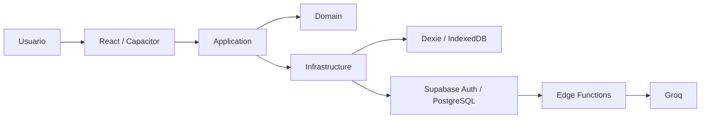

# Lunumia

> Claridad para tus finanzas.

Lunumia es una aplicación de finanzas personales **local-first** para organizar
ingresos, gastos, presupuestos y periodos financieros. Funciona sin cuenta y
mantiene el CRUD principal disponible offline. Cuando el usuario inicia sesión,
Supabase complementa la experiencia con autenticación, sincronización
multidispositivo, respaldo remoto y Edge Functions. También puede instalarse
como PWA y empaquetarse como aplicación Android mediante Capacitor.

## Características

- Periodos mensuales o quincenales e identificación del periodo activo.
- Ingresos, gastos, categorías y presupuestos por categoría.
- Pagos recurrentes y generación de ocurrencias.
- Dashboard con saldo, dinero realmente disponible y ritmo de gasto.
- Simulador del impacto de una compra antes de registrarla.
- Exportación e importación de respaldos JSON versionados.
- Funcionamiento offline e instalación como PWA.
- Registro, login, logout, confirmación por correo y recuperación/cambio de
  contraseña.
- Sincronización bidireccional para usuarios autenticados.
- Captura o selección de recibos, compresión y formulario editable asistido por
  OCR.
- Sugerencia de categorías, resumen de periodo y explicación de cambios con IA.
- Aplicación Android con cámara, estado de red, navegador externo y lifecycle
  nativo de Auth.

## Principio local-first

La persistencia primaria del CRUD es **Dexie sobre IndexedDB**. Se puede usar
Lunumia como invitado, crear y consultar información, realizar cálculos,
exportar respaldos y navegar por la aplicación sin una cuenta.

Supabase no sustituye esa base local. Con una sesión autenticada y conectividad,
la cola de sincronización envía cambios locales a PostgreSQL y descarga cambios
remotos. Auth, sincronización, eliminación de cuenta y las funciones de OCR/IA
sí requieren servicios remotos.



## Stack

| Área               | Tecnologías                                                      |
| ------------------ | ---------------------------------------------------------------- |
| Frontend           | React 19, React Router, TypeScript estricto, Vite 8              |
| Persistencia local | Dexie 4, IndexedDB                                               |
| PWA                | vite-plugin-pwa, Workbox, Service Worker                         |
| Backend            | Supabase, PostgreSQL, Row Level Security, Auth, Edge Functions   |
| Email de Auth      | Resend mediante SMTP personalizado de Supabase Auth              |
| IA                 | Groq, `GroqAIProvider`, Edge Function `ai-insights`, Zod         |
| Mobile             | Capacitor 8, Android, Camera, Network, Browser y App             |
| Validación         | Zod 4                                                            |
| Testing            | Vitest, React Testing Library, fast-check, fake-indexeddb, jsdom |
| Calidad            | ESLint, Prettier, TypeScript y GitHub Actions                    |

## Requisitos previos

- Node.js 22.x (`>=22 <23`).
- pnpm 11.9.0, baseline fijada mediante `packageManager`.
- Git.
- Para Android: Android Studio, Android SDK 36 y un JDK compatible con Android
  Gradle Plugin 8.13 / Gradle 8.14.3.
- Para operaciones remotas: un proyecto de Supabase y acceso a su Dashboard.

## Instalación

Este checkout no contiene metadata de Git y, por tanto, no permite recuperar
una URL remota confiable. Sustituye los placeholders por la URL y el directorio
reales de tu repositorio:

```bash
git clone <REPOSITORY_URL>
cd <REPOSITORY_DIRECTORY>
pnpm install
```

Crea `.env.local` a partir de `.env.example` y completa únicamente las
variables públicas requeridas. Después inicia Vite:

```bash
pnpm dev
```

## Variables públicas del frontend

```dotenv
VITE_SUPABASE_URL=
VITE_SUPABASE_PUBLISHABLE_KEY=
```

Toda variable `VITE_*` puede incluirse en el bundle del navegador. Nunca debe
contener contraseñas, claves de Groq o Resend, `service_role`, tokens u otros
secretos. La publishable key se usa junto con RLS; no otorga privilegios
administrativos.

Sin estas variables, el modo local/invitado continúa disponible, pero Auth,
sincronización y Edge Functions quedan deshabilitados.

## Scripts

Los siguientes scripts existen en `package.json`:

| Comando             | Propósito                                     |
| ------------------- | --------------------------------------------- |
| `pnpm dev`          | Servidor Vite de desarrollo                   |
| `pnpm build`        | Typecheck por proyectos y build de producción |
| `pnpm preview`      | Preview local del build                       |
| `pnpm typecheck`    | Validación TypeScript                         |
| `pnpm test`         | Vitest en modo interactivo                    |
| `pnpm test:run`     | Suite Vitest de una sola ejecución            |
| `pnpm lint`         | ESLint                                        |
| `pnpm lint:fix`     | ESLint con correcciones automáticas           |
| `pnpm format`       | Formatea con Prettier                         |
| `pnpm format:check` | Comprueba formato sin escribir                |

## Configuración de Supabase

La CLI está instalada como dependencia de desarrollo. No es necesario instalar
un binario global:

```bash
pnpm exec supabase login
pnpm exec supabase link --project-ref <PROJECT_REF>
pnpm exec supabase db push --dry-run
pnpm exec supabase db push
```

El repositorio contiene migraciones para el esquema financiero, RLS, índices,
idempotencia, funciones RPC de sincronización y rate limiting distribuido.
Revisa siempre el `dry-run` antes de aplicar migraciones a un proyecto remoto.
La política se configura en `private.edge_rate_limit_policies` (IA: 10/60 s;
OCR: 5/60 s) y solo debe cambiarse mediante una migración revisada.

### Supabase Edge Function secrets

Configura secretos en Supabase, nunca en variables `VITE_*`:

```bash
pnpm exec supabase secrets set AI_PROVIDER=groq --project-ref <PROJECT_REF>
pnpm exec supabase secrets set GROQ_MODEL=openai/gpt-oss-20b --project-ref <PROJECT_REF>
pnpm exec supabase secrets set GROQ_API_KEY="<YOUR_GROQ_API_KEY>" --project-ref <PROJECT_REF>
```

`GROQ_MODEL` es configurable; `openai/gpt-oss-20b` es el modelo operativo
documentado actualmente. La Edge Function no define un modelo por defecto y
falla de forma segura si falta la configuración requerida.

Otras variables backend reconocidas por el código son:

- `AI_ENVIRONMENT`, `AI_TIMEOUT_MS` y `ALLOWED_ORIGINS` para IA.
- `OCR_PROVIDER`, `OCR_ENVIRONMENT`, `OCR_TIMEOUT_MS` y `ALLOWED_ORIGINS` para
  recibos.
- `SUPABASE_URL` y las claves públicas inyectadas por el runtime de Supabase.
- `SUPABASE_SERVICE_ROLE_KEY` únicamente en `delete-account`; jamás debe llegar
  al frontend.

### Edge Functions

Solo existen estas funciones:

- `ai-insights`: sugerencias, resúmenes y explicaciones mediante IA.
- `recognize-receipt`: validación y orquestación del reconocimiento de recibos.
- `delete-account`: eliminación remota de datos e identidad autenticada.

Despliegue genérico, no ejecutado automáticamente por este repositorio:

```bash
pnpm exec supabase functions deploy ai-insights --project-ref <PROJECT_REF>
pnpm exec supabase functions deploy recognize-receipt --project-ref <PROJECT_REF>
pnpm exec supabase functions deploy delete-account --project-ref <PROJECT_REF>
```

## Email: Supabase Auth y Resend

Supabase Auth utiliza Resend como SMTP personalizado para confirmación de
cuenta, recuperación de contraseña y demás correos de autenticación. El SMTP y
las plantillas se administran en **Supabase Dashboard**, no en este repositorio.

El rebranding del código no modificó esa configuración remota. Antes de una
entrega pública revisa manualmente:

- sender name: **Lunumia**;
- plantilla de confirmación de cuenta;
- plantilla de recuperación de contraseña;
- remitente, dominio de envío y enlaces de redirección;
- tracking de enlaces desactivado si altera los callbacks de Auth.

Nunca almacenes la API key de Resend, el password SMTP ni otras credenciales en
el README o en el frontend.

## Autenticación

El cliente de Supabase usa sesiones persistentes, renovación automática y flujo
**PKCE**. La aplicación implementa registro, login, logout, confirmación por
correo, recuperación y cambio de contraseña. En Android controla la renovación
de sesión al pasar entre foreground y background, y procesa tanto cold starts
como eventos `appUrlOpen`.

El callback nativo actual es:

```text
com.gastoclaro.app://auth/callback
```

Debe estar incluido en la allow list de Redirect URLs del Dashboard de
Supabase. El identificador es histórico y se conserva para mantener
compatibilidad con instalaciones, sesiones y enlaces existentes. No lo cambies
aisladamente a un identificador nuevo.

Sin cuenta, los datos pertenecen a un owner invitado local. Al autenticar una
cuenta, la UI permite decidir si se migran, conservan o descartan los datos del
invitado según el flujo de entrada. La migración de owner se realiza de forma
atómica.

## Sincronización

```text
CRUD local → IndexedDB → SyncQueue → Supabase
```

Cuando hay sesión y conexión, el coordinador realiza ciclos de descarga,
subida y nueva descarga. El diseño incluye:

- `operationId` para idempotencia remota mediante `processed_operations`;
- orden cronológico y dependencias parent-before-child;
- cursores por tipo de entidad y paginación keyset;
- retries con backoff exponencial;
- Last-Write-Wins (LWW) con desempate determinista;
- tombstones para impedir que reaparezcan eliminados;
- sincronización al iniciar, reconectar o solicitarla manualmente;
- aislamiento local por owner y remoto mediante RLS.

## Inteligencia artificial

```text
Web / Android → Supabase Edge Function ai-insights → Groq
```

`GROQ_API_KEY` permanece en Supabase Edge Function Secrets y nunca llega al
navegador ni a Android. Las operaciones disponibles son:

- `suggest-category`;
- `period-summary`;
- `explain-changes`.

La IA es opcional. Un timeout, rate limit o resultado inválido degrada la
experiencia sin bloquear el CRUD financiero.

### La IA no calcula cifras

TypeScript calcula importes, totales, porcentajes, diferencias y métricas. El
dominio almacena dinero mediante enteros `AmountCents`; por ejemplo:

```text
700000 cents → $7,000.00
```

Después de validar el contrato con Zod, la Edge Function convierte de manera
determinista esos enteros a contexto monetario de presentación. Groq recibe las
cifras ya formateadas: solo sugiere categorías, redacta resúmenes o explica
cambios; no interpreta centavos ni realiza conversiones financieras.

`period-summary` usa Structured Outputs con JSON Schema estricto. Todas las
respuestas vuelven a validarse con Zod y disponen de fallbacks seguros.

IA y OCR consumen un contador fijo distribuido por usuario autenticado y
función. El RPC deriva el owner de `auth.uid()`, no acepta `userId`, máximo ni
ventana desde el cliente, y actualiza el contador atómicamente en PostgreSQL.
IA comparte una política común entre sus tres rutas. Al superar el límite se
responde `429` con `Retry-After`; si el storage falla, la función falla cerrada
con un error `503` sanitizado antes de invocar un proveedor con costo.

## OCR y recibos

```text
Cámara o galería
  → validación y compresión
  → ReceiptRecognitionProvider
  → Edge Function recognize-receipt
  → formulario editable
  → confirmación del usuario
  → gasto local
```

El OCR es asistido: el usuario puede corregir comercio, fecha, total, moneda y
categoría antes de crear el gasto. La imagen solo se mantiene durante el flujo
de captura/vista previa; no se persiste con el gasto. Ante timeout, baja
confianza o respuesta inválida se ofrece entrada manual.

El proveedor versionado actualmente es `MockOCRProvider`, permitido únicamente
en `development`, `local` o `test`. Antes de ofrecer OCR real en producción se
debe integrar un proveedor productivo detrás de la interfaz `OCRProvider`. El
flujo manual continúa funcionando mientras ese proveedor no exista.

La captura nativa solicita `includeMetadata: false`. Solo se conserva en memoria
el archivo JPEG/PNG validado y comprimido necesario para el flujo; la imagen y
el texto OCR crudo no se guardan en el gasto ni en respaldos.

## PWA y modo offline

El manifest instala la aplicación con el nombre **Lunumia**. Workbox genera el
Service Worker durante el build, precarga assets estáticos y usa NetworkFirst
para navegación. Las llamadas a Supabase se mantienen NetworkOnly para evitar
cachear respuestas autenticadas.

El CRUD local, cálculos, simulador y respaldos funcionan offline. Auth inicial,
sync, OCR remoto e IA necesitan conectividad. Cuando existe una actualización
del Service Worker, la UI solicita confirmación antes de activarla.

## Android y Capacitor

- Nombre visible: **Lunumia**.
- App ID técnico: `com.gastoclaro.app`.
- Deep link: `com.gastoclaro.app://auth/callback`.
- Plugins: Camera, Network, Browser y App.

El appId histórico se conserva deliberadamente. Una futura migración de package
ID requeriría planificar instalación, firma, sesiones, datos locales, Redirect
URLs y publicación en tienda como una operación independiente.

Desde la raíz:

```bash
pnpm build
pnpm exec cap sync android
```

En Windows:

```powershell
cd android
.\gradlew.bat assembleDebug
```

El APK se genera en:

```text
android/app/build/outputs/apk/debug/app-debug.apk
```

Instalación opcional con Android Platform Tools:

```bash
adb install -r android/app/build/outputs/apk/debug/app-debug.apk
```

## Arquitectura por capas

- `presentation`: páginas React, componentes, hooks y contextos.
- `application`: contratos Zod, casos de uso, puertos y orquestadores.
- `domain`: entidades, value objects, reglas y cálculos financieros puros.
- `infrastructure`: adaptadores Dexie, Supabase, Auth, Sync, OCR, IA y
  Capacitor.
- `app`: composition root y selección de adaptadores por plataforma.

La dirección principal es `Presentation → Application → Domain`.
Infrastructure implementa los puertos requeridos por Application. Domain no
depende directamente de React, Dexie, Supabase, Groq ni Capacitor.

```text
src/
├── app/
├── application/
├── domain/
├── infrastructure/
├── presentation/
├── shared/
└── tests/

supabase/
├── functions/
│   ├── ai-insights/
│   ├── delete-account/
│   └── recognize-receipt/
└── migrations/

android/
.kiro/
```

## Backups y compatibilidad del rebranding

Los respaldos nuevos usan `appName: "Lunumia"` y nombres de archivo
`lunumia-backup-YYYY-MM-DD.json`. El importador sigue aceptando respaldos
históricos cuyo `appName` contiene el nombre anterior del producto.

El JSON contiene información financiera y debe almacenarse y compartirse como
archivo sensible. El contrato excluye passwords, access/refresh tokens, API
keys, headers de autorización, `SyncQueue` e imágenes.

Aunque la marca pública es Lunumia, algunos identificadores internos se
mantienen intencionalmente para no perder datos ni romper instalaciones:

- IndexedDB: `GastoClaroDB`;
- storage keys: `gastoclaro.guest-owner-id` y
  `gastoclaro.active-owner-id`;
- appId y URL scheme: `com.gastoclaro.app`;
- nombres históricos de migraciones, tests, caches y el directorio de specs.

No renombres manualmente estos valores. No representan la marca pública actual.

`GastoClaroDB` contiene datos financieros locales, pero no passwords, secretos
de Groq/API ni una copia adicional de tokens de Auth. IndexedDB no está cifrado:
una persona con acceso físico o al perfil del navegador/dispositivo podría
inspeccionarlo. Un eventual cifrado local requiere un diseño independiente de
gestión de claves; no debe sustituirse por criptografía casera.

## Testing y calidad

```bash
pnpm format
pnpm lint
pnpm typecheck
pnpm test:run
pnpm build
```

El proyecto incluye pruebas unitarias, de componentes, integración y
property-based. fast-check valida invariantes de AmountCents, DateOnly,
periodos, presupuestos, ocurrencias, cálculos, cola de sync, LWW y tombstones.
fake-indexeddb permite comprobar la persistencia Dexie sin depender de un
navegador real.

CI ejecuta instalación con lockfile congelado, lint, typecheck, pruebas y build
en cada push a `main` y pull request.

## Seguridad

- Todas las tablas financieras remotas tienen RLS y políticas por `auth.uid()`.
- Las consultas locales se aíslan por owner.
- La clave de Groq existe únicamente como secreto de Edge Functions.
- Las credenciales SMTP/Resend se configuran únicamente en Supabase.
- `SUPABASE_SERVICE_ROLE_KEY` se reserva para `delete-account` en backend y
  nunca debe estar en el frontend.
- Las variables `VITE_*` son públicas por definición.
- `.env`, archivos de secretos y estado local de Supabase están excluidos por
  `.gitignore`.
- No registres JWT, códigos PKCE, access tokens, refresh tokens ni payloads
  financieros sensibles.
- Los contadores distribuidos viven en el esquema `private`, con tablas sin
  grants para `anon`/`authenticated`; solo el RPC allowlisted es ejecutable.
- `public/_headers` incluye CSP, `nosniff`, Referrer-Policy,
  Permissions-Policy y protección anti-framing. Vite lo copia a `dist`; el
  hosting debe soportar el formato `_headers` o configurar los mismos valores
  en su panel/proxy. No se emulan headers HTTP con meta tags.

### Verificación local RLS y rate limiting

No ejecutes estas pruebas con cuentas personales ni contra producción. Con
Docker activo, inicializa/arranca Supabase local, aplica migraciones y crea dos
usuarios desechables desde Studio. Después usa la URL PostgreSQL local mostrada
por `pnpm exec supabase status`:

```bash
pnpm exec supabase init
pnpm exec supabase start
pnpm exec supabase db reset
psql "$DATABASE_URL" -v ON_ERROR_STOP=1 -v user_a='<UUID_A>' -v user_b='<UUID_B>' -f supabase/tests/rls-verification.sql
psql "$DATABASE_URL" -v ON_ERROR_STOP=1 -v user_a='<UUID_A>' -v user_b='<UUID_B>' -f supabase/tests/rate-limit-verification.sql
```

Para comprobar la carrera atómica, limpia solo el contador del usuario de
prueba, lanza 20 transacciones concurrentes y confirma que el contador queda
capado en 11 (límite + 1), sin actualizaciones perdidas:

```bash
psql "$DATABASE_URL" -v ON_ERROR_STOP=1 -c "delete from private.edge_rate_limits where user_id = '<UUID_A>' and scope = 'ai-insights'"
pgbench -n -c 20 -j 4 -t 1 -D "user_a='<UUID_A>'" -f supabase/tests/rate-limit-concurrency.pgbench.sql "$DATABASE_URL"
psql "$DATABASE_URL" -v ON_ERROR_STOP=1 -c "select request_count from private.edge_rate_limits where user_id = '<UUID_A>' and scope = 'ai-insights'"
```

Los scripts funcionales usan `BEGIN`/`ROLLBACK`; el comando de concurrencia
crea únicamente contadores de usuarios locales desechables.

## Privacidad

Los datos principales se guardan primero en el dispositivo. La sincronización
remota ocurre para el owner autenticado cuando la funcionalidad está configurada
y existe conectividad. Esta descripción técnica no sustituye una política de
privacidad ni constituye una afirmación legal sobre tratamiento de datos.

## Limitaciones conocidas

- LWW puede sobrescribir silenciosamente una edición concurrente; no existe
  CRDT ni resolución manual avanzada de conflictos.
- Relojes de dispositivos desincronizados pueden afectar la elección LWW.
- El rate limiting requiere aplicar la migración PostgreSQL antes de desplegar
  las versiones nuevas de `ai-insights` y `recognize-receipt`.
- IA, sincronización, Auth y OCR remoto dependen de conectividad y de la
  disponibilidad/cuotas de servicios externos.
- El código solo incluye `MockOCRProvider`; falta integrar un proveedor OCR
  productivo.
- Android está generado y produce un APK debug, pero su instalación, cámara,
  sync y deep links deben validarse manualmente en cada release/dispositivo.
- iOS no está implementado.
- No existe evidencia versionada de publicación en Google Play.
- El build web emite una advertencia por un chunk minificado mayor a 500 kB.
- Se conservan appId, URL scheme, IndexedDB y claves locales históricas por
  compatibilidad.

## Capturas

> Pendiente: agregar capturas finales de Lunumia. No existen screenshots de
> producto versionados actualmente.

## Desarrollo guiado por especificaciones

`.kiro/specs/gasto-claro-app/` contiene `requirements.md`, `design.md` y
`tasks.md`. El nombre del directorio es histórico; la marca pública actual es
Lunumia y la carpeta no debe renombrarse sin un plan de compatibilidad.

## Aviso

Lunumia es una herramienta de organización financiera personal. No proporciona
asesoría financiera, fiscal, contable ni de inversión.
